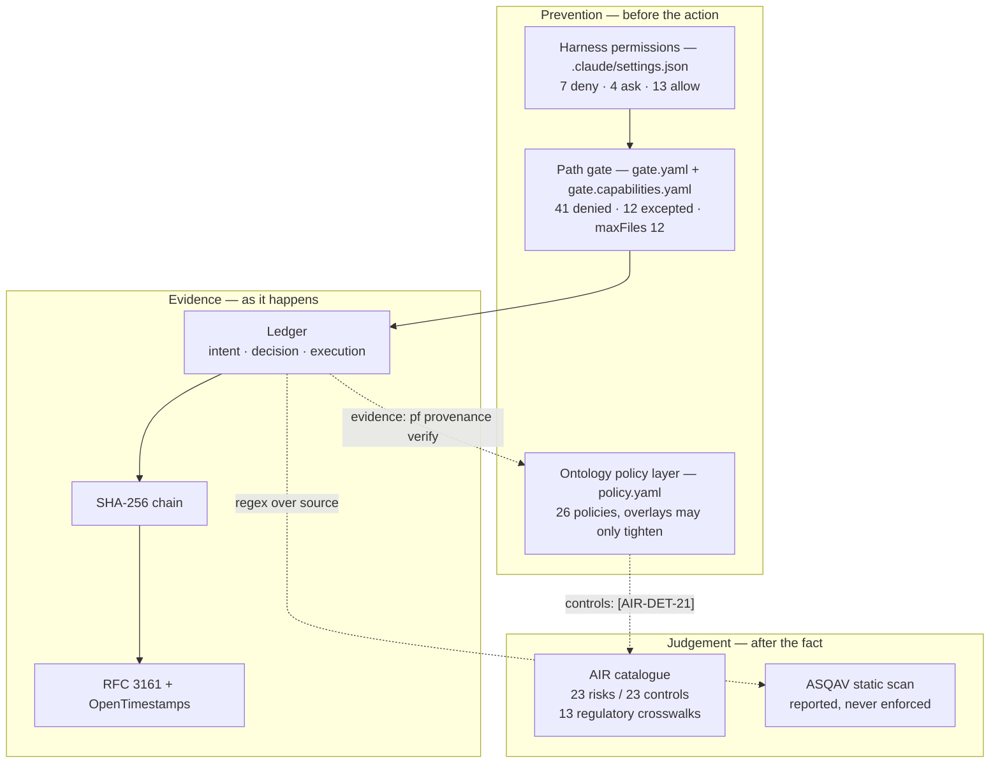

# AI governance architecture

How this platform governs the agents that work inside it: what stops an agent
before it acts, what records what it did, what judges whether those are the
right controls, and which of those can actually fail a merge.

This is the cross-cutting view. The subsystem references go deeper on their own
layer — [`GOVERNANCE.md`](GOVERNANCE.md) (the provenance ledger),
[`POLICY.md`](POLICY.md) (the ontology policy overlay) and [`AIR.md`](AIR.md)
(the control catalogue). Read this one for how they compose, where the seams
are, and what each one cannot see.

The last two sections are an assessment rather than a description: findings
verified against the code on `main`, and the threat model they imply.

---

## 1. The governing idea

An agent working in a monorepo of eight tenants can read a sister company's
business logic, rewrite a shared engine, bump a vendored dependency, or edit the
record of what it did. None of those are failures of intent — they are the
default behaviour of a capable tool given a broad instruction.

Governing that needs five questions answered, and no single mechanism answers
more than one of them well:

| Question | Mechanism | Evidence kind | Blocks a merge? |
|---|---|---|---|
| What may an agent *attempt*? | harness permissions | configuration | n/a — blocks the call |
| Which *paths* may it touch? | the path gate (`gate.yaml`) | configuration | yes, at commit |
| What is *true* of this repo's data and agents? | the ontology policy layer (`policy.yaml`) | declaration | yes, via `pf check` |
| What did an agent *actually do*? | the provenance ledger | runtime | conditionally — see §11 |
| Are these the *right* controls? | the AIR catalogue (FINOS) | external standard | only what an entity commits to |
| Do the controls *exist in the source*? | the ASQAV scan | static analysis | never, by design |

The load-bearing decision is that these **fail in different directions**, so
they are not redundant. The `ai-governance.yml` workflow states it directly:

> A clean scan with a broken chain means the controls exist and are not working.
> A clean chain with a failing scan means the paths that are instrumented are
> sound and something new is not. Neither result is the other's evidence.

A repository can satisfy both and still be missing a control nobody thought to
build. That is what the catalogue is for, and it has already earned its place —
it found two policies claiming enforcement that does not exist.



---

## 2. Plane 1 — the harness: what an agent may attempt

`.claude/settings.json` declares what the agent harness will even offer. Three
verdicts, and everything unlisted falls through to the operator's default.

**Denied outright (7).** `Read(./.env)`, `Read(./.env.*)`,
`Read(**/secrets.toml)`, `Read(**/.dlt/secrets.toml)`,
`Read(**/credentials/**)`, `Edit(vendor/**)`, `Write(vendor/**)`.

Two intentions are visible. The five `Read` rules keep secrets out of the
context window at all — a secret never read cannot be echoed into a log, a
commit message or a model provider's request body. The two `vendor/**` rules
encode the repo's standing rule that *bumping a pin is a human decision, never
an agent's*.

**Held for a human (4).** `git push`, `gh pr create`, `gh pr merge`,
`git submodule update`. These are the outward-facing actions — the ones that
leave the machine or change what other people see. The implication is the shape
of the whole model: **an agent may write code freely and may not publish it.**

**Pre-approved (13).** `uv run pf:*`, `uv run pytest:*`, `uv run ruff:*`,
`uv sync`, `just:*`, and the read-only halves of git and `gh` (`status`, `diff`,
`log`, `show`, `pr view`, `pr diff`, `run list`) — the platform's own toolchain
plus observation. Everything that lets an agent find out what is true without
changing it.

**Hooks.** `PreToolUse` and `PostToolUse` both match
`Edit|Write|MultiEdit|NotebookEdit|Bash` and run `platform/hooks/pre_tool_use.py`
and `platform/hooks/post_tool_use.py`. This is the seam to the ledger: the same
matcher that decides a call is worth gating decides it is worth recording.

This is the weakest of the planes — it governs one client, and an agent invoked
another way never sees it. It is first because it is cheapest, not because it is
strongest. §12 shows where that matters.

---

## 3. Plane 2 — the path gate: which paths may be touched

Implemented in `platform/src/pf/loops/gate.py`; rules in `gate.yaml`
(hand-written, heavily commented) and `gate.capabilities.yaml` (generated from
installed capabilities).

It evaluates **paths, one at a time, plus one aggregate rule on the count**. It
does not evaluate tools — that dimension lives in the hook. `Bash` is recorded
but deliberately *not* path-gated, because "pretending a command string is a
path would produce confident, wrong verdicts".

### Evaluation order — first hit wins

| # | Section | Verdict | Note |
|---|---|---|---|
| 1 | `denylist_except` | allow | checked first, and only against `denylist` |
| 2 | `denylist` | **deny** | "generated artefact or secret — never edited by hand" |
| 3 | `platform_denylist` | **deny** | *only when `in_project=True`* |
| 4 | `autoMergeAllowlist` | allow | |
| 5 | `impact_required` | warn | "run impact analysis before changing this" |
| 6 | — | allow | rule `default` |

Then one extra `deny` if the change touches more than `maxFiles: 12` paths —
*"a single run may touch at most 12 files; split the change"*. This is a
reviewability control, not a safety one: it keeps an agent's unit of work inside
what a person will actually read.

### Two sections, one merge rule

`load_policy()` reads `gate.yaml`, then **appends** — never replaces — any
list-valued section from `gate.capabilities.yaml`. Two files rather than one so
that installing a capability never rewrites `gate.yaml`: a YAML round-trip would
silently drop every comment in it, *and the comments are where the reasons for
each rule live*.

That append-only merge is what makes **"nothing installable can loosen the gate
that judges it"** structurally true rather than aspirational. It is reinforced a
layer up: `pf.tools.spec` defines
`TIGHTENING_SECTIONS = {denylist, platform_denylist, impact_required}`, and a
`Tool` contributing to `denylist_except`, `autoMergeAllowlist`, `maxFiles` or
`blockOn` raises `InvalidTool` **at import**. That rule is itself a policy:
`tool-contribution-may-only-tighten`, mapped to `AIR-PREV-19`.

### What is denied, and why it is two different things

The denylist mixes two purposes, expressed identically:

- **Must not leak** — `.env`, `.env.*`, `**/secrets.toml`, `**/credentials/**`,
  `**/.dlt/secrets.toml`, plus the name heuristics `**/*_key*` and
  `**/*_secret*`, and `**/data/*.quack.json` (which holds a session auth token).
- **Must not be hand-edited** — `provenance/**`, `**/target/**`,
  `**/kg/graph.duckdb`, `**/kg/context_card.md`, `**/kg/architecture.md`,
  `**/mdl/mdl.json`, the Bloom exports, `.dagster/` runtime state, and 17 more
  contributed by capabilities.

`provenance/**` is the one that matters most here: *an agent that can edit the
record of what it did has no record of what it did.* The hash chain makes
tampering **evident**; the denylist makes it **denied**. The hooks write there
directly rather than through the `Edit` tool, so nothing legitimate is blocked.

### An exception says "git may carry this", never "edit this"

`denylist_except` exists because generated files sometimes must be tracked.
`.github/workflows/**` is the sharpest case: denied so an agent cannot hand-edit
the gate that judges it, but excepted so git can carry it — because *"denied and
untrackable meant the merge gate could be regenerated and never actually run — a
control that exists on disk and nowhere else."*

`pf check` is the reconciliation between those halves: it compares what git
tracks against what the gate calls generated, and fails when they disagree. A
generated file that git tracks is a file with two writers.

---

## 4. Plane 3 — the ontology policy layer

A **different system** from the path gate, and easily confused with it.
`gate.yaml` governs *paths*; `platform/src/pf/ontology/policy.yaml` governs
*claims about the platform* — 26 policies covering data semantics, agent
behaviour and supply chain. It is the layer that carries the regulatory
mapping.

### The invariant: overlays may only tighten

Scopes are platform → group → project. A layer can do exactly three things:
**add** a policy the platform does not have, **tighten** an inherited policy's
severity, or **enforce** it by naming another artifact or evidence kind. There
is no syntax for lowering a severity and none for deleting a policy.

An attempted relaxation raises `PolicyRelaxation` **at load time, not at check
time**, and that distinction is the design:

> A relaxed policy that only failed when something tripped over it would be
> discovered by the incident it was written to prevent.

An omitted `severity:` means *inherit*, not downgrade, so an overlay that only
adds evidence cannot escalate a policy behind the author's back. `applies_to`
and `params` cannot be overridden at all. The principle is stated plainly:
**a governance layer that each project can weaken is not a governance layer.**

### The traceability spine

25 of the 26 policies carry explicit `controls:` ids, and each names how it is
enforced and what evidence proves it. The agent-governance subset:

| Policy | Severity | Enforced by | Controls |
|---|---|---|---|
| `agent-decisions-are-recorded` | error | `pf.provenance.ledger:decision`, both hooks | `AIR-DET-21`, `AIR-DET-4` |
| `evidence-chain-is-tamper-evident` | error | `chain:verify`, `anchor:stamp_rfc3161`, `gate.yaml:denylist` | `AIR-DET-21` |
| `agent-authority-is-revocable` | error | `ledger:revoke`, `ledger:is_revoked` | `AIR-PREV-18` |
| `high-impact-actions-need-a-human` | error | `ledger:approve`, `audit:report` | `AIR-DET-11` |
| `sister-projects-are-isolated` | error | `gate.yaml:platform_denylist`, `loops.gate:project_for` | `AIR-PREV-22` |
| `agent-authority-is-least-privilege` | error | — | `AIR-PREV-18` |
| `secrets-never-in-context` | error | — | `AIR-PREV-23`, `AIR-DET-16` |
| `model-routing-is-declared` | warning | `pf.agents.base:AGENTS` | `AIR-PREV-10` |
| `tool-contribution-may-only-tighten` | error | `pf.tools.spec:Tool.gate_sections` | `AIR-PREV-19` |

This is what turns a compliance question into a traversal: `pf air crosswalk
eu-ai-act` walks Article 12 (record-keeping) to `agent-decisions-are-recorded`
and `evidence-chain-is-tamper-evident`, and from there to the chain and the
anchor — so *"how do you satisfy Article 12"* is a path through the repository
rather than a paragraph about it.

---

## 5. Plane 4 — the ledger: what actually happened

The only plane that produces **runtime** evidence.

### Five stages, three of them records

| Stage | Written when | Answers |
|---|---|---|
| 01 `intent` | before the tool runs | what was about to happen |
| 02 `decision` | the gate's verdict | whether it was allowed |
| 03 `execution` | after the tool returns | what actually happened |
| 04 chain | on every append | has anything been altered |
| 05 anchor | out of band | did this exist at a point in time |

Stages 04 and 05 are properties *of* records, not records themselves. Splitting
intent from execution is what makes an **ungated** action detectable at all: a
single line written after the fact cannot distinguish "allowed and ran" from
"ran".

### Where each path is instrumented

| Path | Stages 01–02 | Stage 03 |
|---|---|---|
| Claude Code tool calls | `platform/hooks/pre_tool_use.py` | `platform/hooks/post_tool_use.py` |
| Programmatic LLM calls | `pf.agents.base.call` | same function |
| Everything else | `pf.provenance.action()` | same context manager |

`action()` is preferred "because it cannot be made to write the stages in the
wrong order", and it writes `execution` even when the body raises:

```python
with action(root, tool="dbt", target="model.orders", summary="rebuild") as a:
    a["detail"] = run_model()
```

Only mutating tools are recorded by default, because "a chain in which every
file read is an action buries the writes that matter". `PF_PROVENANCE_SCOPE=all`
widens it.

Two details worth knowing. The hook writes **INTENT before consulting the
gate**, so a denial is recorded against an intent that already exists. And
`post_tool_use.py` will **not** write a bare EXECUTION when it finds no stashed
action — *"writing a bare EXECUTION would manufacture an action that was never
gated."*

For LLM calls, **the routing table is the policy**: `cfg.name in AGENTS` decides
the verdict. An unregistered step records `deny` only when enforcement is on,
and `warn` otherwise — written that way deliberately, because *"a recorded
'deny' followed by a successful execution is a worse record than no record."*
That is a control designed not to trip the very invariant the audit checks.

### The record, and why the canonical form is pinned

`provenance/chain.jsonl`, one JSON object per line:

```
seq, action_id, stage, ts, actor, session, group, project,
tool, target, payload, prev, hash
```

Canonical bytes are the record without `hash`, with keys sorted at every level,
separators `,` and `:`, non-ASCII literal UTF-8, and **no floats anywhere**.
The float ban is the detail that reveals the intent: `0.1` does not round-trip
identically across languages, and a digest a second implementation cannot
reproduce turns "verifiable by anyone" into "verifiable by us" *without anything
failing*. Timestamps are whole seconds for the same reason.

`prev` is inside the digest — that is what makes it a chain rather than a list
with a pointer. Appends are serialised under `flock`, and the chain is
`fsync`ed before the head sidecar moves, so a crash leaves the head
stale-but-behind rather than advertising a record that was never written.

### What the audit checks

`pf provenance verify` asks four questions, ordered by what they can prove —
integrity, completeness, coverage, oversight — plus one that deserves its own
name. Exactly five findings are fatal:

| Finding | Meaning |
|---|---|
| `chain.broken` | a record does not hash to its digest, or a link does not join |
| `action.ungated` | an EXECUTION with no DECISION — work that bypassed the gate |
| `decision.not_enforced` | a recorded `deny`/`hold` followed by a successful execution |
| `stage.out_of_order` | DECISION before INTENT, or EXECUTION before DECISION |
| `oversight.self_approved` | a held action approved by its own actor |

Everything else — `action.dangling`, `anchor.none`, `anchor.lag`, and the
per-token anchor checks — is a **warning that exits 0**.

`decision.not_enforced` is the one to understand: it catches the failure mode
where the ledger looks strictest exactly where it is weakest — every blocked
action recorded, and none of them blocked.

### Anchoring: two clocks, because they fail differently

RFC 3161 is immediate and legally recognised, and its trust is the authority's
key — if that authority disappears with its certificate, old tokens become
unverifiable. OpenTimestamps needs no trusted party and stays verifiable as long
as Bitcoin does, but costs hours to confirm. *The RFC 3161 token answers "was
this here this morning" today; the Bitcoin attestation answers it in twenty
years.*

What is anchored is the **chain head hash** — there is no Merkle tree.
Anchoring the head covers everything beneath it, so batching costs no coverage;
the un-anchored window is the exposure, and `pf provenance status` reports it
rather than assuming it is zero.

Anchoring is deliberately **not** in the hook: both anchors need the network,
and a `PreToolUse` hook that makes a network call adds its latency and its
failure modes to every tool call the agent makes. When the TSA is unreachable
the anchor is recorded with `status="failed"` and nothing blocks — *"a TSA being
unreachable is an operational fact, not a crash."*

### Fail-open by default, fail-closed where it counts

```
PF_PROVENANCE_ENFORCE=0   (default) a recording failure never blocks work
PF_PROVENANCE_ENFORCE=1             an unrecordable action is a denied action
```

The default is argued rather than assumed: *a governance system whose failure
mode is "the whole team stops" gets switched off, and a switched-off system
records nothing.* Regulated deployments should set `1`.

Two things ignore the flag, "because a control a setting can bypass is not a
control": **revocation** (a revoked actor is refused at INTENT, before the gate
runs) and **an unreadable `revoked.json`** — "I cannot tell whether you are
revoked" must not resolve to "carry on".

### Verifiable by anyone

`platform/entrypoints/verify_provenance.py` is a stdlib-only verifier that
imports nothing from this platform, and `pf provenance export` ships a copy of
it beside the chain — so an auditor receives the evidence *and* the means to
check it in one bundle. Its docstring carries the full spec, so it can be
rewritten in any language by someone who does not trust ours. Timestamps are
checked with `openssl ts -verify` and `ots verify`, not with our code.

CI runs both verifiers, and names the tie-break: *"if these two ever disagree,
the bundled verifier is the one that is wrong in the way that matters, because
it is the one shipped to people who cannot check our work."* §11 records that
they do in fact disagree, structurally.

### The ledger is not in git

`provenance/**` is gitignored except the anchor tokens. It is append-only,
machine-written runtime state: every branch would conflict on it, and a merge
would silently reorder a hash chain into an invalid one. Durability comes from
anchoring the head and archiving `pf provenance export`, not from git.

---

## 6. Plane 5 — the control catalogue

The ledger proves what an agent did; the scanner asks whether controls exist in
source. Neither says **which controls there should be** — and for a regulated
deployment that is the part somebody external judges.

`vendor/ai-governance-framework` is the FINOS AI Governance Framework (CC BY
4.0), vendored as a submodule: **23 risks** typed `RC`/`OP`/`SEC` and **23
controls** typed `PREV`/`DET`, cross-walked to **13 regimes** — EU AI Act,
ISO/IEC 42001, NIST SP 800-53r5, NIST AI 600-1, OWASP LLM/ML/ASI, FFIEC,
SR 11-7, IOSCO, the UK and Canada regimes, and an agentic threat registry.
Risks 24–29 are the agentic ones: authorization bypass, tool-chain manipulation,
MCP supply-chain compromise, state poisoning, multi-agent trust boundaries,
credential harvesting.

Three design choices are worth naming:

- **Catalogues are registered, not hardcoded.** Nothing in the reader names a
  framework; a second catalogue registers via the `pf.catalogues` entry point.
  Two catalogues claiming the same id prefix are refused, because that would
  make a baseline ambiguous.
- **Ids are derived, never stored** — `{prefix}-{type}-{sequence}`. So a `type:`
  change upstream *renames* a control and every baseline naming the old id
  silently stops matching. That is exactly what `pf air verify` exists to catch,
  and why the corpus is pinned as `kind: data` at severity `error`.
- **Absence is a state, not an error.** An uninitialised submodule makes every
  control assess as `unexercised` rather than raising — which is also why the
  CI job checks out submodules, or *"the gate passes for the wrong reason"*.

Coverage is **derived on every run and never stored**, for the same reason the
onboarding ladder derives its verdicts: a recorded pass survives the change that
invalidated it.

---

## 7. Plane 6 — the static scan, reported not enforced

`vendor/asqav-compliance` scans agent source for five controls — audit trail,
policy enforcement, revocation, human oversight, error handling — mapped to the
EU AI Act, DORA and ISO 42001. It runs on every PR with `fail-on-gaps: false`.

The reasoning for not enforcing it is the most instructive paragraph in the
governance docs. The scanner is regex over source: it currently reports
**Audit Trail: GAP** on `pf/agents/base.py` — a file whose every LLM call writes
three hash-linked ledger records — because the patterns it looks for are
`import asqav`, `.sign(`, `audit_log` and `logger.`.

> Raising that score by renaming our functions to match its regexes would change
> the score and not the governance, so we have not.

That instinct is worth preserving. **A metric that can be satisfied by renaming
is a metric that will be.** The action is pinned as a submodule and run from the
checkout rather than by tag, so the code that judges our compliance cannot change
without a commit here.

---

## 8. Earned autonomy: how much an agent may do unattended

Nine loops run on cadences. Each has a level, and the level is *earned from a
track record*, not configured.

| Level | What it permits |
|---|---|
| **L1** | The proposal is **recorded only**. No branch, no PR. The recording is the promotion evidence. |
| **L2** | Gate → git worktree on a new branch → write and commit → impact analysis from the branch's real diff → optional Recce review → `gh pr create`, or leave the branch with the reason recorded. |
| **L3** | Identical to L2 today. **The merge step is intentionally absent.** |

The PR body a loop opens says it outright: *"A human merges; a loop never does."*
Nothing has earned L3 yet.

**Born level vs earned level are kept apart on purpose.** `LoopSpec.autonomy` is
where a loop was born — registry code, changed in a pull request. The earned
level lives in `loop-levels.json` next to the ledger that proves it.

**Promotion needs evidence *and* a person:**

```
L1 -> L2   >= 20 clean runs in 30 days, 0 errors in the last 10,
           contract evals passing
L2 -> L3   >= 50 clean runs in 60 days, 0 reverted patches ever at L2,
           live eval pass rate >= 0.95 recorded in the last 14 days
```

"Clean" is `ok` or `noop`; `proposed` counts only once the proposal was merged
or accepted, *because a proposal nobody looked at is not evidence of anything*.
`pf loop promote` prints the evidence and a human confirms; `--force` is
recorded as `"forced: …"` rather than `"earned: …"`.

**Demotion is automatic**, and the asymmetry is deliberate: *"a reverted patch
is the only hard evidence that the loop's judgement was wrong in a way that
reached a human… it resets the clock."* The revert is appended to the ledger
*first* and the demotion derived from it — "recording the revert and forgetting
to demote was the failure this ordering prevents."

A group may lower a loop's ceiling but never raise it, and lowering is **refused
outright for a loop that writes** — L1 means writes nothing, so the honest move
is `enabled: false` with a reason. `vendor-drift` is pinned at L1 by intent:
*"the value of the pin is that someone read the diff, and an automatic bump
destroys the only evidence that anyone did."*

Promotion and merge consume the same eval scores, *"so a loop cannot be promoted
on evidence that a merge would have refused."*

A **circuit breaker** opens on three consecutive failures or when the group's
daily token budget is spent, and it does not un-latch on its own: *"escalate to
a human; clear by resolving the finding, not by retrying."*

---

## 9. Six stores, deliberately separate

Confusing these is the most common way to misread the system.

| Store | Path | Holds | Read by |
|---|---|---|---|
| Provenance chain | `provenance/chain.jsonl` | hash-linked intent/decision/execution | `pf provenance verify`, `export` |
| Tracking DB | `data/_platform.duckdb` | counts: tokens, cost, status, durations | dashboards, evals, loop bodies |
| Trace log | `logs/trace/**.jsonl` | transcripts + governance `decision` events | `pf logs`, CI artifacts |
| Run ledger | `groups/<g>/loop-ledger.json` | loop run history — the promotion evidence | `levels.eligibility`, breaker |
| Eval scores | `data/evals/latest.json` | last contract/live tier result | promotion, merge gate |
| Earned levels | `loop-levels.json` | `{loop@project: level, actor, reason}` | `levels.effective` |

The relationship between the first two is stated as a rule: **the database is a
mirror, not the record.** `chain.jsonl` is the evidence; DuckDB is for querying
and the UI; nothing writes to DuckDB on the hot path; *"a mirror that disagrees
with the chain loses."* The chain is JSONL rather than a database deliberately —
*"an auditor with `sha256sum` and `python -c` must be able to check it."*

Traces record the user prompt verbatim but store only a **SHA-256 prefix and a
character count** of the cached system block, and redact `api_key|token|secret|
password|authorization`. A trace write failure disables tracing rather than
failing the run: *"a full disk must not take an agent down."*

---

## 10. Where a human is required

Governance that never stops is not governance. The deliberate stop points:

**Publishing** — `git push`, `gh pr create`, `gh pr merge` are `ask` rules.
**Vendor pins** — denied to edit, and `git submodule update` is an `ask`.
**Merging a loop's work** — no level permits it; the merge step does not exist.
**Promotion** — refuses unless the evidence is there, and a named actor confirms.
**Revert** — `pf loop revert --note` is how a human tells the ledger; the
demotion follows from the ledger, not from the command.
**Proposal resolution** — `accept`/`reject`, the latter with a mandatory note.
**Circuit breaker** — cleared only by hand.
**Escalation by the model itself** — `Diagnosis.escalate` and `FixPatch.safe =
False` stop a proposal being drafted at all; `Answer.covered = False` makes the
ask agent say "no metric covers this" rather than guess.
**The kill switch** — `pf provenance revoke <actor>`, checked before intent and
failing closed on an unreadable file.
**Held actions** — `pf provenance approve <action>`, with self-approval recorded
as a finding rather than silently accepted.
**Waivers and suppressions** — a waiver without a reason and a memory
suppression without a note are both refused.
**Ontology and vendor approval** — `pf semantic approve` (the CLI's one
interactive confirm, with a `--by` steward for the audit trail) and
`pf vendor approve`.

---

## 11. Findings

Verified against `main` while writing this document. Ordered by consequence.
Each was checked in the code or reproduced, not inferred from documentation.

### F1 — The impact-analysis warning cannot fire for dbt model SQL

`autoMergeAllowlist` is evaluated at step 4 and `impact_required` at step 5, so
an allowlisted path never reaches the warning. `**/*.sql` is on the allowlist.
Reproduced:

```
allow  allowlist:**/*.sql                  …/transform/models/marts/fct_orders.sql
warn   impact_required:**/transform/models/**/*.yml   …/transform/models/marts/schema.yml
```

So changing a **model's SQL** — the highest-blast-radius edit in a data platform
— is allowed silently, while changing its `schema.yml` warns. Two of the nine
`impact_required` patterns are unreachable. The suite already hints at this: the
test for the warn path has to construct a synthetic `gate.yaml` to exercise it.

*Fix:* move `impact_required` above `autoMergeAllowlist`, or narrow the
allowlist's `**/*.sql` to exclude `**/transform/models/**`.

### F2 — The blocking provenance check does not run in CI

`ai-governance.yml` guards it with `if [ -f provenance/chain.jsonl ]`, and
`provenance/*` is gitignored with nothing tracked beneath it. A CI checkout
therefore never has a ledger, the step prints *"No ledger in this checkout"* and
passes. `GOVERNANCE.md` calls `pf provenance verify` "the blocking check in CI";
in practice the only thing blocking there is the tamper **unit test**.

This is defensible — the workflow explains that source checkouts hold no runtime
evidence — but the effect is that **the audit runs where the evidence is, which
is not CI.** If runtime evidence is meant to gate anything, it needs a job with
access to a real ledger (an exported bundle, or a scheduled run against a
long-lived environment).

### F3 — The two verifiers disagree by construction

CI runs the bundled audit and the standalone auditor's copy, and anticipates
disagreement. The disagreement is structural, not hypothetical:

- `verify_provenance.py` checks **only** integrity and completeness — it does
  not check `decision.not_enforced`, stage ordering or self-approval.
- It is **stricter on thresholds**: it exits 1 on *any* missing stage, while the
  bundled audit rates a dangling action as a `warn` and exits 0.

So an action in flight at export time fails the auditor's copy and passes ours.
Worth aligning the completeness threshold, or documenting the difference in the
exported bundle's README.

### F4 — `--anchors` failures never fail the audit

A failed token verification is recorded as a `warn`, so `pf provenance verify
--anchors` exits 0 even when a stored `.tsr` does not verify — including the
common case where `openssl` simply is not installed on the runner. The docs say
"non-zero exit on a failure" without distinguishing this.

### F5 — `vendor/**` is gate-protected only for project sessions

`vendor/**` sits in `platform_denylist`, which applies only when
`in_project=True`. Reproduced:

```
in_project=True    deny   platform_denylist:vendor/**
in_project=False   allow  default
```

So "read-only, always" is enforced for *every* session by the harness
`Edit/Write(vendor/**)` deny, but by the gate only for project sessions. An
agent on a different harness, or a script calling `pf` directly from a platform
session, is not gate-blocked. Given that a vendor pin bump is explicitly a human
decision, `vendor/**` arguably belongs in the main `denylist`.

### F6 — The human-approval path has no production caller

`action(..., require_approval=True)` implements hold-and-approve, and
`pf provenance approve` records the approval with a self-approval check. But
`require_approval=True` appears nowhere outside its own definition and the docs.
The mechanism is built, tested and **unwired** — so the `high-impact-actions-
need-a-human` policy (`AIR-DET-11`) is currently discharged by the harness `ask`
rules rather than by the ledger that claims it.

### F7 — One agent path writes no provenance

`pf.agents.ask.answer_live()` runs a bounded tool-use loop directly against the
client rather than through `base.call()`. It has its own guardrails — 8 turns,
50 rows, a three-tool allowlist with no SQL — but it writes **no provenance
records** and does not increment the shared spend counter, so its tokens are
invisible to the loop budget and the circuit breaker.

### F8 — `blockOn` is configuration that nothing reads

`gate.yaml` ends with `blockOn: breaking`, presented as configuration. The gate
never consults it; the threshold is a hardcoded literal in the CLI. The only
other references are two docstrings and a regex that flags *adding* a `blockOn`
line as "gate loosened". Either wire it up or drop it — a knob that does nothing
is worse than no knob, because someone will turn it.

### F9 — An undeclared severity ranks as `error` by accident

Three policies declare `severity: blocks`, which is not in
`SEVERITY_RANK = {info: 0, warning: 1, error: 2}` nor in the `Severity` literal.
`SEVERITY_RANK.get(sev, 2)` maps it to `error`. The direction is fail-safe, but
nothing validates the vocabulary, so a typo (`eror`) silently becomes the
strictest setting — and two unknown severities compare equal, so a tightening
between them cannot be detected. Given this layer's own "fail at load time"
philosophy, an unknown severity should be a load error.

### F10 — Smaller things

- The package docstring points at `provenance/verify_chain.py`, which does not
  exist; the file is `platform/entrypoints/verify_provenance.py`.
- `platform/workspace.yaml` is denylisted twice, with two comments that disagree
  about which command generates it.
- OTS anchors are recorded as `pending` — correctly, since reporting `ok` at
  submission "would overstate the evidence" — but the audit counts `pending` as
  coverage, so an unconfirmed receipt alone yields `anchor.current`.
- On non-POSIX platforms `fcntl` is absent and the chain append takes **no lock
  at all**, silently. Concurrent appends would fork the chain, which "reads to a
  verifier as tampering rather than as a race". There is no test for this path.
- `pf evals-gate` is wired into no workflow; live evals never run automatically.
- No input validation or prompt-injection guard exists anywhere in `pf.agents` —
  evidence blocks are truncated, not sanitised.
- Token budgets are checked **after** the body returns; the daily budget is
  enforced only at the start of the *next* run.

---

## 12. Threat model

**Caught.**

- An agent edits the record of what it did → denied by the gate; if written
  another way, the chain makes it evident.
- A record is altered, re-sealed, or removed → `seq` and `prev` both break, and
  the suite simulates each attack including the competent re-seal.
- An action runs without passing the gate → `action.ungated`.
- A denial is recorded and the action runs anyway → `decision.not_enforced`.
- An agent approves its own held action → `oversight.self_approved`.
- A vendored catalogue changes under us → `pf air verify` fails on a renamed
  control or a changed `type:` letter.
- Secrets reaching the context window → denied at the harness before a read.
- A loop's judgement proves wrong → a revert demotes it immediately and resets
  the clock.
- An installed capability tries to loosen the gate → `InvalidTool` at import.

**Not caught — and worth stating plainly.**

- **Truncation of the chain's tail.** A valid prefix remains valid, and the
  suite pins this as a *negative* test rather than claiming otherwise: "the
  chain cannot detect its own truncation… an auditor holding an earlier anchored
  head is what catches it."
- **Anything outside the instrumented paths.** The harness rules govern one
  client; the ledger records the paths that call it (see F7).
- **Attribution is not authentication.** `actor` comes from an environment
  variable. Binding an action to a person needs a signature, which the code
  names as the natural extension once actors have keys.
- **A wrong-but-permitted action.** The gate judges paths and counts, not
  whether a change is correct — and per F1, not dbt model SQL at all.
- **The un-anchored window.** Everything since the last anchor rests on local
  integrity only.
- **A compromised TSA** — which is precisely why a second, trustless anchor
  exists.
- **Prompt injection.** Nothing inspects model inputs.
- **Controls nobody thought to build.** What the catalogue is for; it currently
  names eight the platform ships without, and says so.

---

## 13. Known gaps the platform already declares

Honesty about gaps is itself a control here — each of these is named in
`docs/AIR.md` rather than left for a reader to discover:

- **No group commits to anything yet.** Every scaffolded `baseline:` is empty,
  so `pf air gate` passes everywhere and blocks nothing. The correct starting
  point, but it means the AIR gate is currently latent.
- **Eight controls are shipped-but-unbuilt**: `AIR-PREV-2` external-KB
  filtering, `AIR-PREV-3` user/app/model firewalling, `AIR-PREV-8` QoS and DDoS,
  `AIR-DET-9` denial-of-wallet spend monitoring (partial), `AIR-PREV-14`
  encryption at rest, `AIR-DET-15` LLM-as-a-judge (partial), `AIR-PREV-17` AI
  firewall, `AIR-PREV-20` MCP server security governance.
- **`AIR-DET-13` fails more interestingly**: two policies claim it and both name
  enforcement that does not exist. Those were paper controls before the
  catalogue arrived — *it is what found them*.
- **A defect in the vendored corpus**: seven risk documents have a list comment
  running into the next key, so YAML absorbs `related_risks:` into the previous
  citation list. `pf air verify` diagnoses it precisely and warns rather than
  fails — a one-newline fix in someone else's repository should not hold our
  merge gate hostage.
- **Submodule availability is a live dependency.** Every job that checks out
  submodules currently fails at checkout because the `vendor/asqav-compliance`
  upstream no longer exists; and without `vendor/ai-governance-framework` every
  control assesses as `unexercised` *and the gate passes for the wrong reason*.

---

## 14. Extending it

- **A rule everyone must follow** → `gate.yaml`; it inherits everywhere.
- **A rule for one entity** → that entity's `governance/policy.yaml`. It may
  only tighten.
- **A capability's own rules** → contribute to `denylist`, `platform_denylist`
  or `impact_required` from the `Tool`. The other sections will refuse you.
- **A new instrumented path** → wrap it in `pf.provenance.action()`; the stage
  ordering is then not yours to get wrong.
- **Claiming a control** → add `controls: [AIR-…]` to the policy entry that
  discharges it, with `enforced_by` and `evidence` that resolve. `pf air verify`
  will tell you if they do not.
- **Committing to a baseline** → `pf air baseline <group> --suggest`, then
  commit what you mean to hold. Until then the AIR gate blocks nothing.
- **A second control catalogue** → register it on the `pf.catalogues` entry
  point with its own id prefix. Nothing in the reader needs to change.
