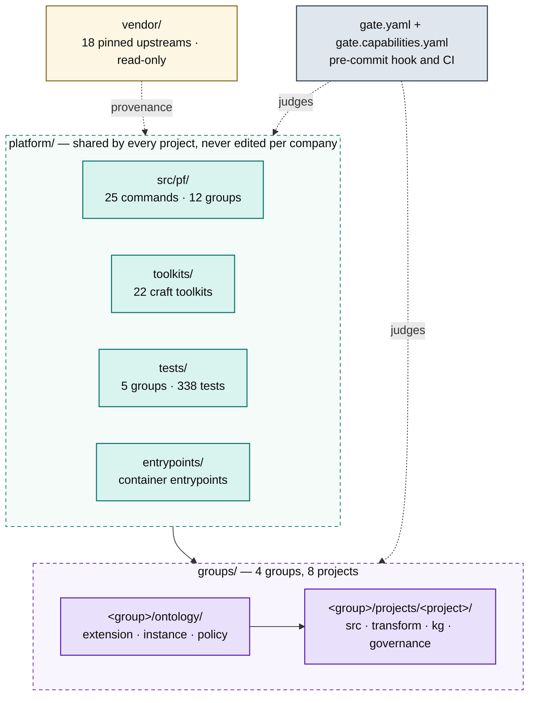
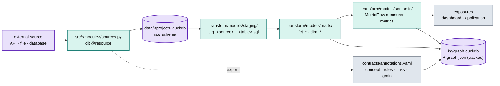
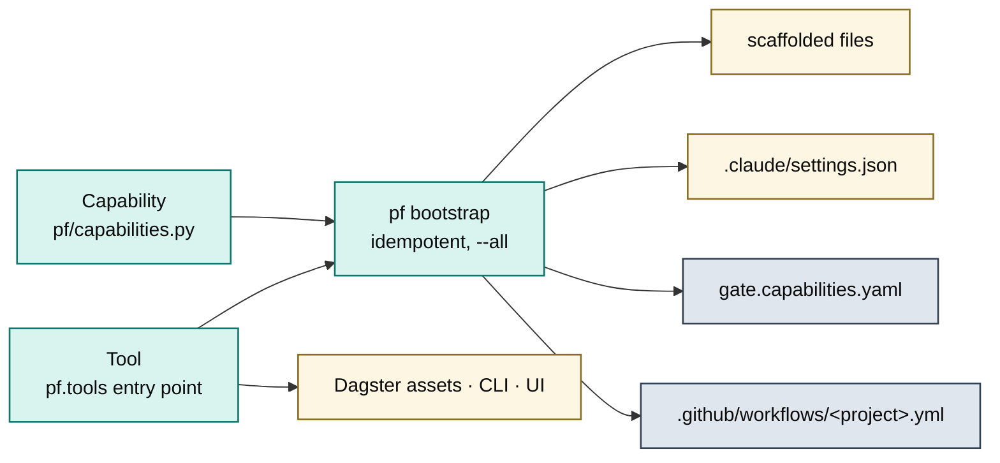
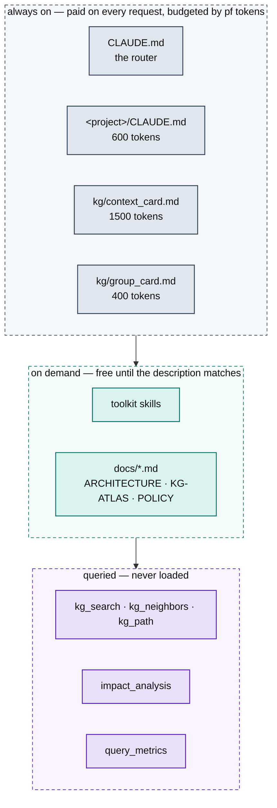
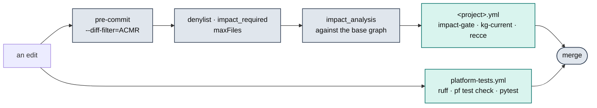

# The platform, drawn from the platform

GENERATED by `pf arch build`. Do not hand-edit — `pf arch check` fails
when this file and the repository disagree, and the repository wins.

4 groups · 8 projects · 22 toolkits · 18 pinned upstreams · 338 tests

Read this instead of grepping. Every diagram is the shape; every table
is the path. Where a question has a fixed answer, it is below.

---

## Where everything lives



**The one rule that is not obvious:** `platform/` is shared by every
project and `groups/<g>/projects/<p>/` is not. Business logic never
transfers between entities — an assumption carried across is a bug, and
`gate.yaml`'s `platform_denylist` refuses the write in both directions.

### Straight to the file

| Looking for | Path |
|---|---|
| the CLI, and everything it does | `platform/src/pf/cli.py` |
| knowledge graph: store, build, query, impact | `platform/src/pf/kg/` |
| ontology, topology, policy, validation | `platform/src/pf/ontology/` |
| MDL · OWL · otop · OpenMetadata exports | `platform/src/pf/projections/` |
| how a feature reaches every project | `platform/src/pf/capabilities.py` |
| pluggable tools (recce, wren, …) | `platform/src/pf/tools/` |
| scaffolding and the idempotent bootstrap | `platform/src/pf/scaffold/` |
| the MCP server an agent actually calls | `platform/src/pf/mcp/server.py` |
| the pre-commit gate | `platform/hooks/pre_commit.sh` + `gate.yaml` |
| what the suite guards | `platform/tests/README.md` |
| what the graph is made of | `docs/KG-ATLAS.md` |
| how policy layers | `docs/POLICY.md` |
| the session layer, hooks and commands | `platform/toolkits/power-tools/` |
| what was taken from each upstream | `platform/src/pf/vendor/registry.yaml` |

---

## One project, source to consumer



Names above are the platform's conventions, not one company's data.
For a real project's tables, marts and metrics, read its card —
`kg/context_card.md`, regenerated by `pf kg card` — or ask the graph.

### What each project actually holds

Counted from the tracked `kg/graph.json`, so this works in a fresh
clone. A `0` is the finding: no Model means the dbt manifest was never
parsed and the merge gate cannot run; no Metric means every business
question falls back to raw SQL.

| Project | Table | Model | Metric | Exposure | Policy | nodes |
|---|--:|--:|--:|--:|--:|--:|
| `acme/acme-eu` | 3 | 7 | 6 | 2 | 11 | 231 |
| `acme/acme-rollup` | 0 | 0 | 0 | 0 | 10 | 112 |
| `acme/acme-us` | 3 | 7 | 6 | 2 | 10 | 230 |
| `globex/globex-core` | 0 | 1 | 0 | 0 | 10 | 103 |
| `globex/globex-eu` | 0 | 1 | 0 | 0 | 10 | 103 |
| `jaffle/jaffle-shop` | 57 | 1058 | 19 | 6 | 10 | 12392 |
| `zenith/zenith-de` | 0 | 1 | 0 | 0 | 10 | 103 |
| `zenith/zenith-uk` | 0 | 1 | 0 | 0 | 10 | 103 |

Every graph carries the same 16 ontology classes and 14 relations — vocabulary is shared at the group, so a project instantiates only the part of it it needs.

Policy is the exception: it layers platform → group → project and may
only ever tighten. A project showing more policies than the floor has
declared obligations of its own — see `docs/POLICY.md`.

---

## How one edit reaches every project



A **Capability** is declarative: files, settings, gate rules, CI jobs.
A **Tool** is a capability that also runs — Dagster assets, a UI, CLI
verbs — registered through a `pf.tools` entry point in any installed
package. Adding either touches no scaffolder, no CLI and no workflow.

| Capability | Default | Contributes |
|---|---|---|
| `bigquery` | opt-in | 2 file(s) · settings · env: BIGQUERY_PROJECT |
| `clickhouse` | opt-in | 2 file(s) · settings · env: CLICKHOUSE_HOST, CLICKHOUSE_PASSWORD |
| `data-quality` | **yes** | — |
| `ducklake` | opt-in | 2 file(s) · settings · env: DUCKLAKE_CATALOG |
| `evidence` | **yes** | 2 file(s) · gate rules · settings |
| `github` | **yes** | 1 file(s) · ci: impact-gate, kg-current · gate rules · settings |
| `governance` | **yes** | 1 file(s) · gate rules |
| `openmetadata` | opt-in | 1 file(s) · gate rules · settings |
| `recce` | opt-in | 1 file(s) · ci: recce · gate rules · settings · env: PF_ARTIFACTS_ACCESS_KEY_ID, PF_ARTIFACTS_SECRET_ACCESS_KEY |
| `redshift` | opt-in | 2 file(s) · settings · env: REDSHIFT_HOST, REDSHIFT_USER, REDSHIFT_DATABASE |
| `snowflake` | **yes** | 2 file(s) · settings · env: SNOWFLAKE_ACCOUNT, SNOWFLAKE_USER, SNOWFLAKE_DATABASE |
| `wren` | opt-in | 1 file(s) · gate rules · settings |

`pf bootstrap --all` is what carries a new one into projects that
already exist. It refuses a partial backfill — a capability applies only
when every file it writes is absent — so it can never overwrite a file
someone has edited.

---

## What context costs



`pf tokens` fails the build when an always-on artefact exceeds its
budget, because that tier is paid by every request for the life of the
project. The graph is the opposite: never loaded, only asked.

---

## What has to pass before a merge



| Workflow | Runs |
|---|---|
| `acme-eu.yml` | generated per project — `pf bootstrap` |
| `acme-rollup.yml` | generated per project — `pf bootstrap` |
| `acme-us.yml` | generated per project — `pf bootstrap` |
| `bot-findings.yml` | hand-written, repo-wide |
| `claude-review.yml` | hand-written, repo-wide |
| `globex-core.yml` | generated per project — `pf bootstrap` |
| `globex-eu.yml` | generated per project — `pf bootstrap` |
| `jaffle-shop.yml` | generated per project — `pf bootstrap` |
| `platform-tests.yml` | hand-written, repo-wide |
| `pr-report.yml` | hand-written, repo-wide |
| `vendor-sync.yml` | hand-written, repo-wide |
| `zenith-de.yml` | generated per project — `pf bootstrap` |
| `zenith-uk.yml` | generated per project — `pf bootstrap` |

---

## Keeping this true

```bash
uv run pf arch build      # regenerate this file
uv run pf arch check      # fail if it and the repo disagree
```

`pf arch check` runs in `platform-tests.yml` and inside the suite, so a
change that alters the shape of this repository cannot merge while this
document still describes the old one.
