# CI workflows, one diagram each

Every GitHub workflow in this repository, drawn. [`CI.md`](CI.md) is the prose;
this is the board version — one diagram per workflow, each with a worked example
underneath it, all of them pasteable into Miro without editing.

## Pasting into Miro

Copy a fenced block's contents (not the fence) and use **Miro → Diagram →
Mermaid**. The syntax here is deliberately plain so it survives that importer:

| rule | why |
|---|---|
| `flowchart TD` only | Miro's importer is flowchart-centric; sequence and state diagrams do not come through |
| no ` `, no HTML tags | dropped silently, taking half the label with them |
| every label double-quoted | a label with a slash, dot or space parses as syntax otherwise |
| no `style`, `classDef` or `linkStyle` | ignored on import, and they make the source harder to edit on the board |
| ASCII only, no parentheses inside labels | the importer is stricter than GitHub's renderer |

Shapes carry meaning: `([ ])` is a trigger, `[ ]` is a job or a step, `{ }` is a
decision, and edge labels are the condition under which that path is taken.

---

## 0. The fleet — what wakes on what

Twenty-three workflows. Nothing here runs "the build"; each answers one question,
and most sleep through any given change.

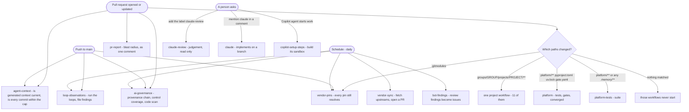

**Example.** You change one dbt model in `jaffle-shop`. `agent-context`,
`ai-governance` and `pr-report` run because they have no path filter;
`jaffle-shop.yml` runs because the path matched; the other ten project
workflows, `platform`, `platform-tests` and `vendor-pins` never start. About
nine checks, not thirty.

---

## 1. A project workflow — `jaffle-shop.yml` and its ten siblings

Generated per project by `pf bootstrap`, all eleven the same shape:
`acme-eu` `acme-rollup` `acme-us` `commodity-india` `commodity-rollup`
`commodity-us` `globex-core` `globex-eu` `jaffle-shop` `zenith-de` `zenith-uk`.

One job diffs the pull request once and publishes a boolean per area; the other
five each declare which boolean they need. This is the most important diagram
here — it is why a README change does not wait on a warehouse build.

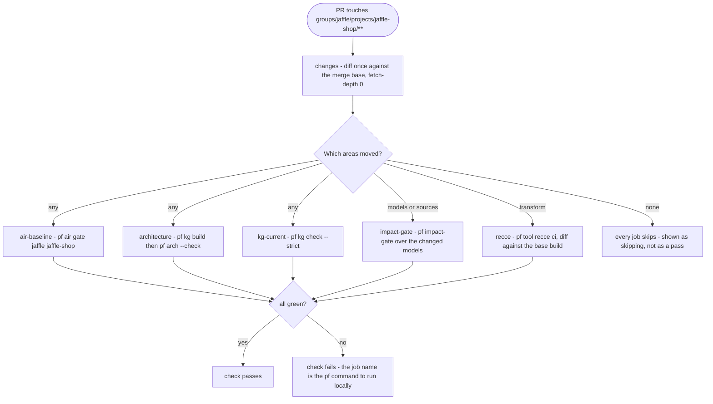

**Example.** Editing `marts/customers.sql` sets `models`, `transform` and `any`,
so all five run. Editing only that project's `README.md` sets `any` alone —
`impact-gate` and `recce` skip, and the review is not held up by a build.

---

## 2. `platform.yml` — the shared engines

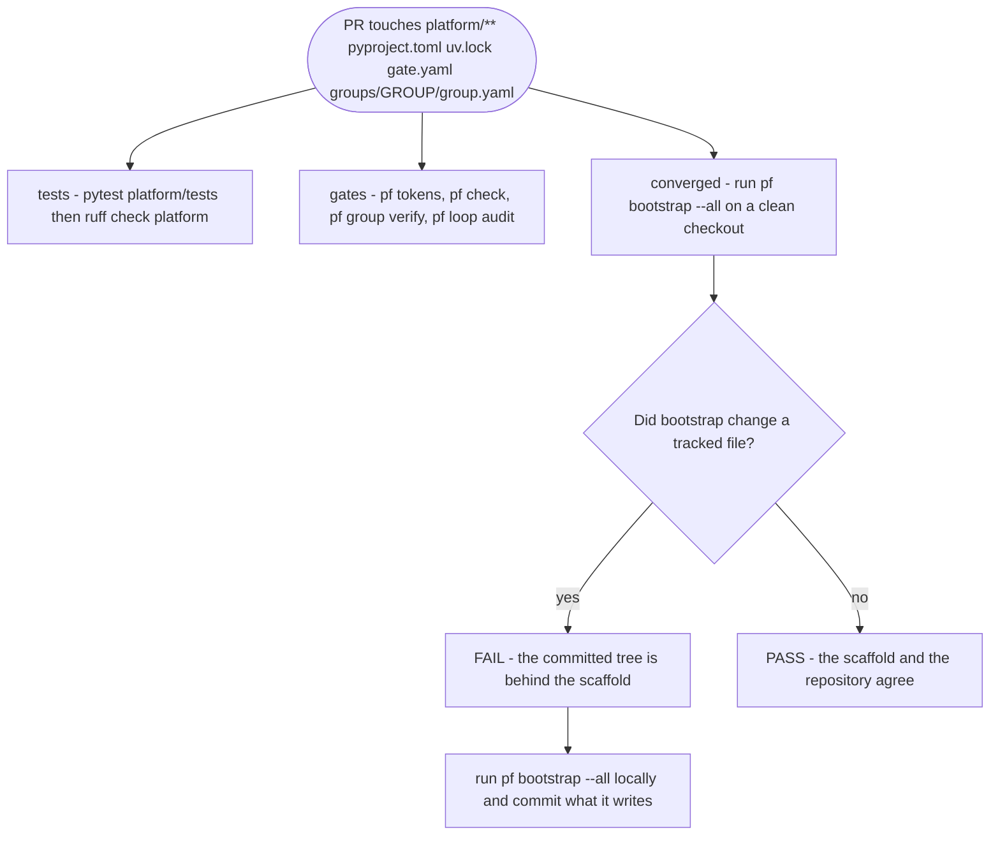

**Example.** You add a capability that writes a new file into every project.
`converged` fails on your PR because the eleven projects do not have it yet —
run `pf bootstrap --all`, commit the files, and the job goes green. This is the
job that catches a project silently drifting behind the scaffold.

---

## 3. `platform-tests.yml` — the suite, on a narrower trigger

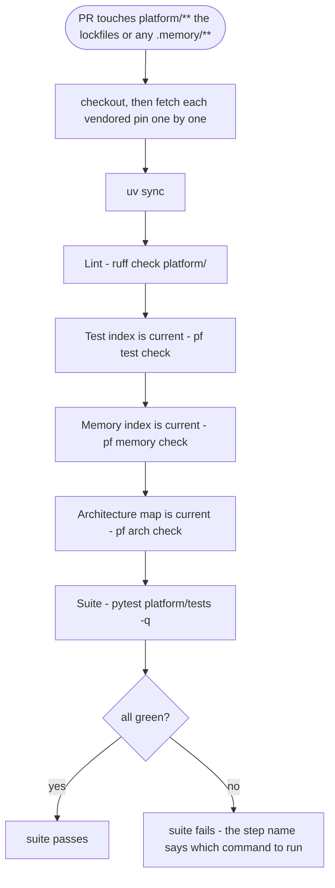

**Example.** You add `platform/tests/gate/test_new_thing.py` and forget
`pf test index`. The suite itself passes; **Test index is current** fails, because
a fresh clone would not list your test. One `pf test index` and a commit fixes it.

---

## 4. `agent-context.yml` — every pull request, no path filter

The one that can repair itself. It is also where the per-commit file cap is
re-applied, which is the layer no developer machine can skip.

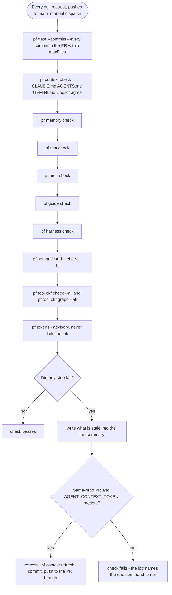

**Example.** You add a memory note with `pf memory add` but do not commit the
regenerated index. **Memory index is current** fails, the summary says so, and
the `refresh` job pushes the regenerated index onto your branch — so the next
agent reads context that matches the code.

---

## 5. `ai-governance.yml` — four checks that fail in different directions

Run together because each is blind to what the others see.

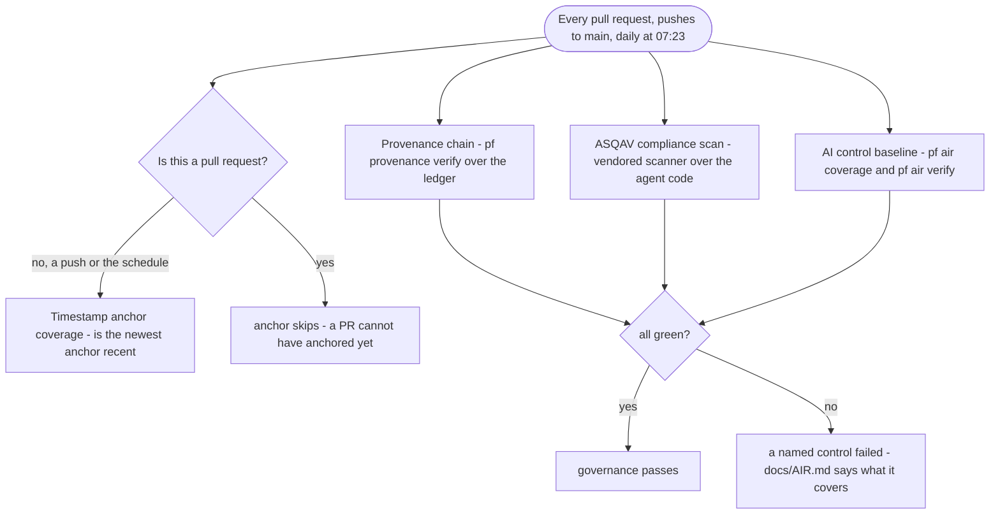

**Example.** An agent edits a file under `provenance/`. The hash chain no longer
verifies, **Provenance chain** goes red, and the PR cannot be merged on a green
board — which is the point: the record of what an agent did is not the agent's
to edit.

---

## 6. `pr-report.yml` — one comment, edited in place

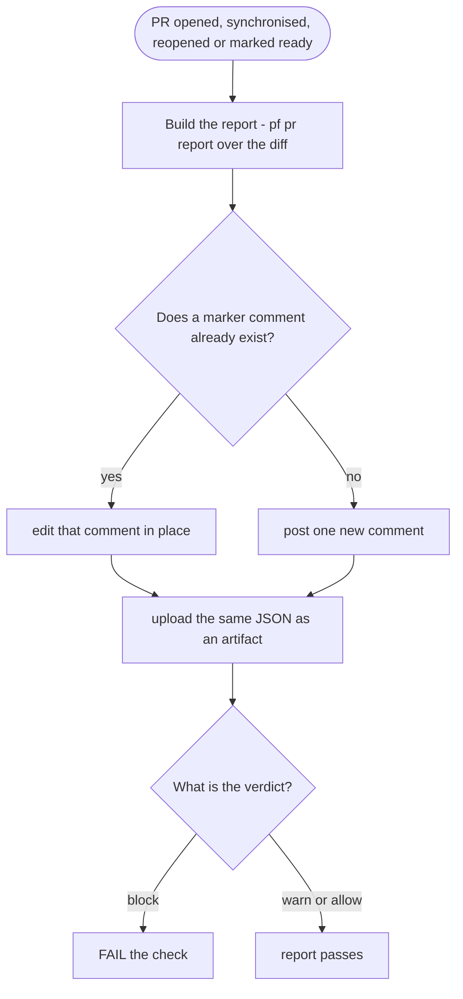

**Example.** You rename a column eleven dashboards read. The comment names the
downstream exposures, the verdict is `block`, and the check goes red — before a
reviewer has read a line of SQL. Eleven pushes later there is still one comment,
not eleven stale ones.

---

## 7. `vendor-pins.yml` — two questions per submodule

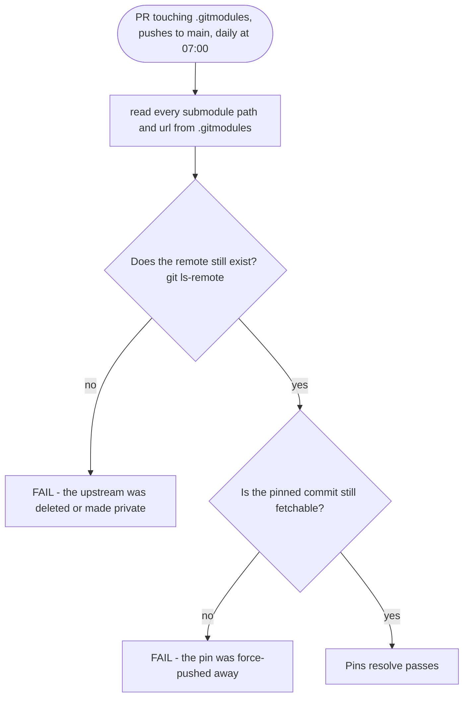

**Example.** An upstream deletes its repository. Nothing in this repo changed,
so no PR is open — the daily run is what notices, and it notices the same day
rather than the next time somebody clones with `--recursive`.

---

## 8. `vendor-sync.yml` — fetches, reports, never approves

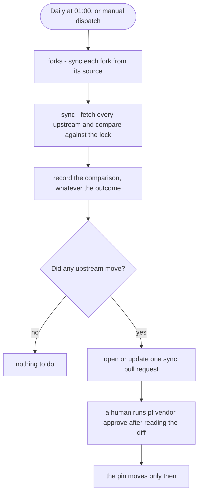

**Example.** `wrenai` publishes a fix. The job opens a PR showing exactly what
moved. It never runs `pf vendor approve`, because approval means *a person read
the diff*, and a workflow cannot mean that.

---

## 9. `loop-observations.yml` — findings go where people already look

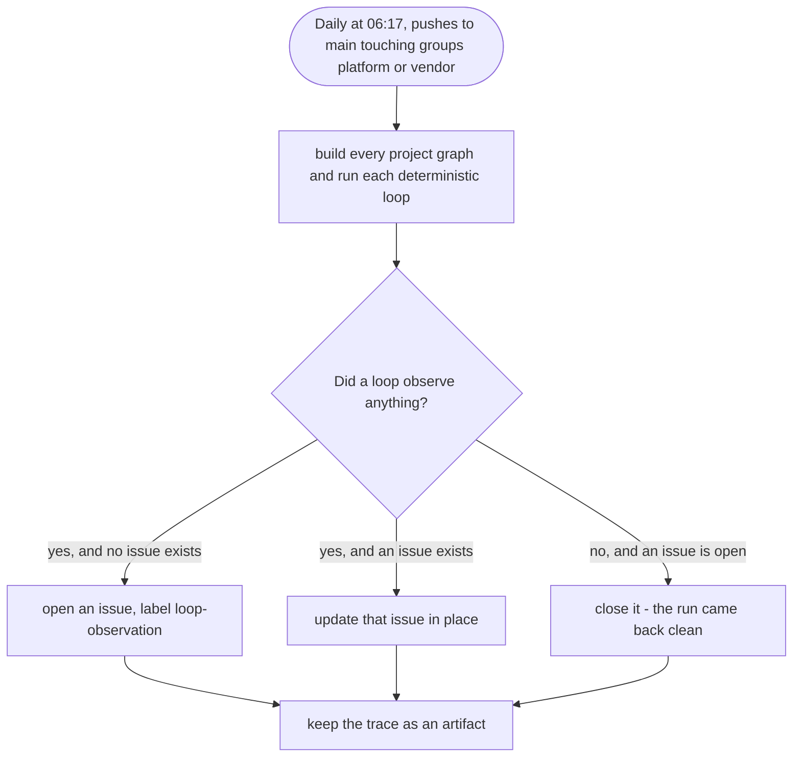

**Example.** A model gains a test that never fails. The loop notices, files one
issue per loop per project, and closes it the day the model changes — so
`loop-ledger.json` is not a file somebody has to remember to open.

---

## 10. `claude-review.yml` — opt in, read only

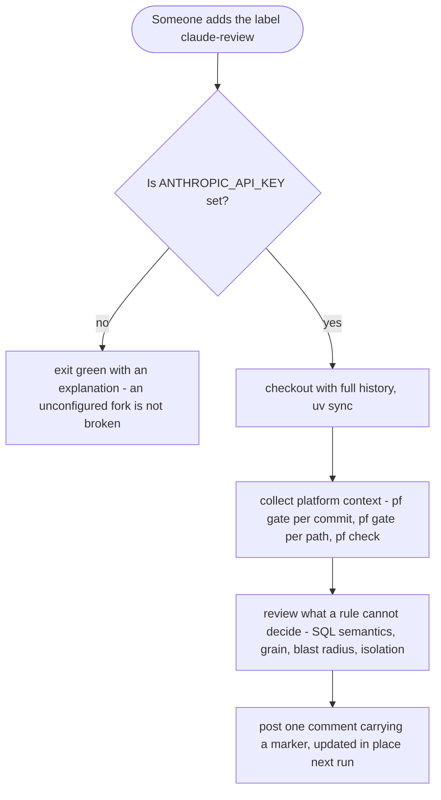

**Example.** A mart pre-aggregates what a metric aggregates. No gate can see
that; the review names the file, the line, and the wrong number it produces.
The gate verdicts go in as *evidence* so the reviewer does not re-derive them.

---

## 11. `claude.yml` — mention it by name, and it writes

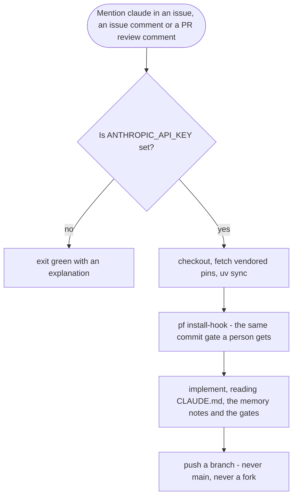

**Example.** An issue says "the safe-divide macro brackets the wrong operand".
It fixes the macro, adds the test, and pushes a branch under the same twelve-file
cap a person commits under — `pf install-hook` is what makes that true.

---

## 12. `copilot-setup-steps.yml` — the sandbox, before the agent starts

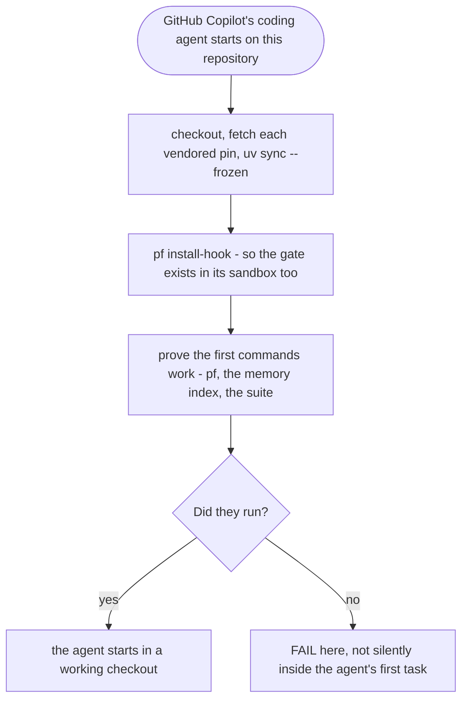

**Example.** Copilot reads `AGENTS.md`, which tells it to run `pf test check`.
This workflow is why that command exists in its sandbox. The file must sit at
exactly this path and the job must carry exactly this name — GitHub looks it up
by both.
