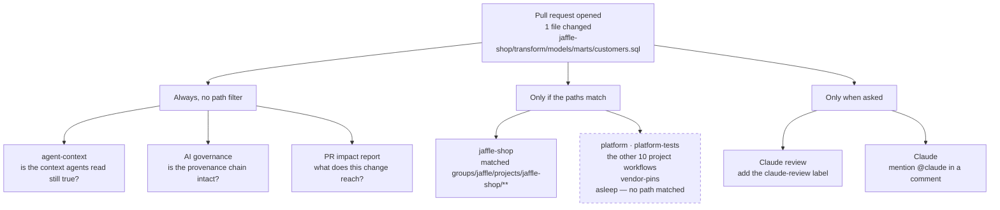
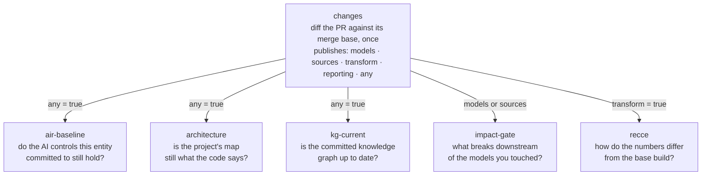
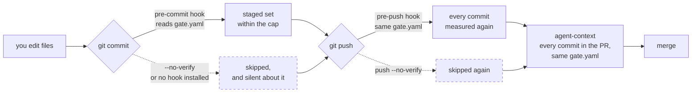

# CI — what runs when you open a pull request

Open a pull request here and thirty-odd checks appear. That looks like one
enormous build. It is not: it is **twenty-three small workflows, each asking one
question**, and most of them stay asleep for any given change.

This page is how to read that list — what wakes up, why, and what to run on your
own machine to fix a red one.

## The one idea

Every workflow is a question with a yes/no answer, and every workflow declares
which paths it cares about. A change to a dbt model in one company wakes that
company's workflow and nothing else's. A change to `platform/` wakes the
fleet-wide ones, because that code is shared by every company.

Three workflows have no path filter at all and run on *every* pull request.
Those are the ones that ask questions no single directory owns: is the context
agents read still true, is the provenance chain intact, what is the blast radius
of this change.

## A worked example

You edit one file:

```
groups/jaffle/projects/jaffle-shop/transform/models/marts/customers.sql
```

and open a pull request. Here is what happens.



Ten of the eleven project workflows never start. `platform.yml` never starts,
because you did not touch shared code. What you get is the three always-on
workflows and `jaffle-shop.yml` — roughly nine checks, not thirty.

## Inside a project workflow

The eleven project workflows all have the same shape. One job diffs the pull
request **once** and publishes a boolean per area; the other five jobs each
declare which boolean they need. A job whose boolean is `false` is skipped, and
shows as *skipping* on the pull request rather than as a pass.



For our one-line change to `customers.sql`: `models`, `transform` and `any` are
all true, so **every** one of the five runs. Had you edited only the project's
`README.md`, `any` would be true and `models`/`transform` false — so
`impact-gate` and `recce` would skip, and you would not wait on a warehouse
build to review a paragraph.

That is the whole trick. Diffing once and fanning out beats eleven jobs each
re-deciding whether they are relevant.

## Every workflow, in four families

### 1. Per project — eleven files, one per project, all generated

`acme-eu` · `acme-rollup` · `acme-us` · `commodity-india` · `commodity-rollup` ·
`commodity-us` · `globex-core` · `globex-eu` · `jaffle-shop` · `zenith-de` ·
`zenith-uk`

Each fires only on `groups/<group>/projects/<project>/**` and runs the six jobs
above. They are written by `pf bootstrap` from the `ci_jobs` each capability
declares — **do not hand-edit them**, the next bootstrap overwrites your change.
Change the capability that contributes the job.

### 2. Fleet-wide — the shared code

| workflow | wakes on | asks |
|---|---|---|
| `platform` | `platform/**`, `pyproject.toml`, `uv.lock`, `gate.yaml`, `groups/*/group.yaml` | three jobs: `tests` (pytest + ruff), `gates` (`pf tokens`, `pf check`, `pf group verify`, `pf loop audit`), `converged` (does `pf bootstrap --all` change any committed file?) |
| `platform-tests` | `platform/**`, the lockfiles, any `.memory/**` | the suite plus the generated-index checks, on a narrower trigger than `platform` |
| `agent-context` | **every** pull request | is every generated artefact current — the memory index, the test index, the repo map, the guide, the harness maps, the MDL manifests, the OKF bundles — and is every commit within the file cap |

`platform / converged` is the unusual one: it re-runs the scaffolder and fails if
the result differs from what you committed. It is how the repo notices that a
project has drifted behind a change to the scaffold.

### 3. Repo-wide, on every pull request

| workflow | asks |
|---|---|
| `AI governance` | is the provenance ledger's hash chain intact (`Provenance chain`), do the agent-code scanners find a governance gap (`ASQAV compliance scan`), do the declared AI controls resolve (`AI control baseline`), and is the newest timestamp anchor recent (`Timestamp anchor coverage`, skipped on PRs) |
| `PR impact report` | what does this change reach? Posts one comment, edited in place, and fails the check if the verdict is a block |
| `bot findings` | turns each review finding into an issue on the findings board, so it outlives the pull request |
| `Vendor pins` | does every pinned submodule still resolve — remote reachable, commit still fetchable |

### 4. Scheduled, or on demand

| workflow | when | does |
|---|---|---|
| `Vendor sync` | daily 01:00 | fetches upstreams, opens a PR. Never approves — approval means a human read the diff |
| `loop observations` | daily 06:17, and pushes to main | runs the loops over every project and files each observation as an issue |
| `bot findings` | also daily 06:17 | sweeps for findings the event triggers missed |
| `Vendor pins` | also daily 07:00 | a pin can rot without anyone touching the repo |
| `AI governance` | also daily 07:23 | the same, for the chain and the anchor |
| `Claude review` | add the `claude-review` label | read-only review of judgement calls a rule cannot make |
| `Claude` | mention `@claude` | implements what an issue or comment asks, on a branch it pushes |
| `Copilot setup steps` | Copilot's agent, before it starts | installs `pf`, the hooks and the suite in its sandbox |

## Going deeper on the platform jobs

This page is the map. [`docs/cicd/`](cicd/) is the depth: one page each for
`gates`, `converged` and `tests` with the exact condition that turns them red,
plus [cicd/audit-trail.md](cicd/audit-trail.md) on the provenance chain and
what CI does and does not verify about it.

## A check is red. Which workflow, and what do I run?

The check name is the **job** name, not the file. This is the map:

| check | workflow | run locally |
|---|---|---|
| `tests` | platform | `uv run pytest platform/tests -q` and `uv run ruff check platform` |
| `gates` | platform | `uv run pf check` · `pf tokens` · `pf group verify` · `pf loop audit --per-group` |
| `converged` | platform | `uv run pf bootstrap --all`, then `git status` — commit whatever it wrote |
| `suite` | platform-tests | `uv run ruff check platform/` · `pf test check` · `pf memory check` · `pf arch check` · `pytest platform/tests -q` |
| `check` | agent-context | the failure names the one command; usually `pf context refresh`, `pf test index`, `pf arch build`, `pf guide build` or `pf harness <g> <p>` |
| `changes` | a project | never fails on its own — it only publishes booleans |
| `air-baseline` | a project | `uv run pf air gate <group> <project>` |
| `architecture` | a project | `uv run pf kg build <g> <p> && uv run pf arch <g> <p> --check` |
| `impact-gate` | a project | `uv run pf impact-gate <g> <p> <models>` |
| `kg-current` | a project | `uv run pf kg check <g> <p> --strict` |
| `recce` | a project | `uv run pf tool recce ci <g> <p>` |
| `report` | PR impact report | `uv run pf pr report` |
| `Pins resolve` | Vendor pins | `git ls-remote` the pin it names |

Almost every job is one `pf` command with the same name as the check. That is
deliberate: a gate you cannot reproduce on your laptop is a gate people learn to
re-run until it passes.

## Generated or hand-written?

| file | who writes it |
|---|---|
| the eleven `<project>.yml` | `pf bootstrap`, from each capability's `ci_jobs` |
| `platform.yml` | `pf bootstrap`, from `PLATFORM_WORKFLOW` in `pf.scaffold.bootstrap` |
| everything else | by hand |

Hand-editing a generated one is silently undone by the next `pf bootstrap`, and
`platform / converged` will fail on the difference. `gate.yaml` denies
`.github/workflows/**` to agents for the same reason, with an exception so the
generated ones can be committed — GitHub only runs what is in the repository.

## Where CI sits relative to your laptop

Some rules are checked twice, and that is deliberate rather than wasteful. A
local hook is fast and can be skipped; a CI job is slow and cannot. The file cap
is the clearest example:



One rule, one file, three moments. The hooks give you the answer in a second;
CI is the one nobody can skip. A commit that genuinely cannot be split says so
in its own message with a `Gate-Exempt: <reason>` trailer, and passes as a
warning that quotes your reason into the log and the review.

[`CI-DIAGRAMS.md`](CI-DIAGRAMS.md) draws each of these workflows on its own,
one diagram per workflow with a worked example, in a plain flowchart syntax that
pastes straight into Miro.

`docs/DEVELOPMENT.md` has the rest of the gate; `docs/GOVERNANCE.md` has the
provenance chain; `docs/AIR.md` has the AI controls.
