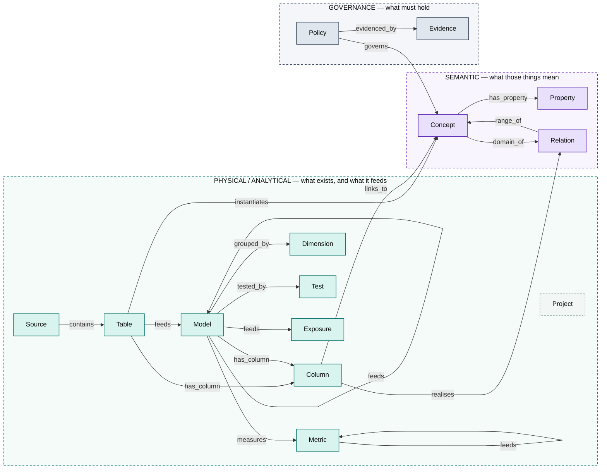
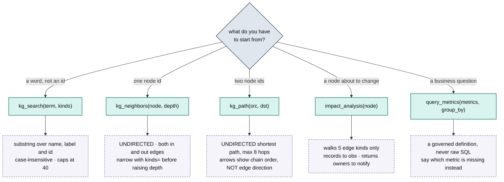
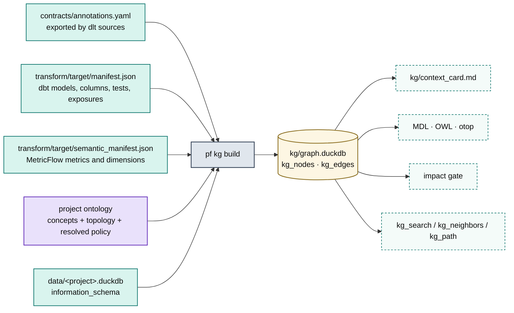

# The knowledge graph, as a map

The graph answers questions about *this project*. It cannot tell you what it is
made of.

That second half is what this file is. It is identical in all eight projects, so
paying for it in every budgeted context card would be eight times the right
price — and leaving it out is how a traversal gets written backwards.

Code: [`platform/src/pf/kg/`](../platform/src/pf/kg/) — `store.py` (the two
tables), `build.py` (what fills them), `query.py` and `impact.py` (what an agent
calls). See also [SEMANTICS.md](SEMANTICS.md) for the four layers the graph is
the join of, and [POLICY.md](POLICY.md) for how its governance plane is
resolved.

---

## Where this sits among the context tiers

| Tier | What it holds | Cost |
|---|---|---|
| Always on, **budgeted** | `CLAUDE.md`, `kg/context_card.md`, the group card | every request, for the life of the project |
| On demand | toolkit skills | only when the description matches |
| **Queried, never loaded** | the knowledge graph | one tool call |

The card is regenerated per project and lists *instances* — acme-us has three
raw tables and six metrics. It never says that `realises` runs Column → Relation,
that `impact_analysis` ignores the semantic plane, or that `kg_path` walks edges
in both directions. Those are properties of the graph itself, and they are what
this file records.

`pf tokens` enforces the budgets: 1500 tokens for a project card, 400 for a
group card. This file is not in any of them. Read it once.

---

## Three planes, one store

Two DuckDB tables hold everything — `kg_nodes` and `kg_edges`. The structure
lives in the `kind` column, and it divides into three planes: what physically
exists, what it means, and what must hold of it.



All fourteen node kinds and all fourteen edge kinds are on that diagram. Nothing
is declared in `NODE_KINDS` or `EDGE_KINDS` that the builder does not emit,
because a declared-but-unbuilt kind is worse than no vocabulary: it makes
traversals that filter on it look implemented when they are dead.

**Project** is dashed because it is an anchor with no edges at all — one node per
graph, carrying group and path in its props, reachable only by id.

The four edges that cross plane boundaries — `instantiates`, `links_to`,
`realises`, `governs` — are the point of the design. They are what let a
semantic or governance question be answered by walking, rather than by reading
three YAML files.

### Colour is fixed, not themed

Mermaid will not recolour an explicit `classDef` fill, and GitHub renders one
source on both a light and a dark page. So every diagram here follows the
`viz-standards` rule: **pale fill, saturated stroke of the same hue, near-black
ink**. A fill picked to look right on white is unreadable on black and there is
no media query inside a diagram to save it.

---

## Every edge runs upstream → downstream

This is a contract, not a convention. `out_edges(n)` is always *"what depends on
n"* and `in_edges(n)` is always *"what n was built from"*, with no per-kind
exceptions to memorise.

`feeds` is named for that direction: a staging model *feeds* a mart. It was once
called `derives_from`, which pointed the other way and made every rendered
lineage path read backwards.

One edge kind is deliberately walked *against* the arrow: `has_column`. Changing
a column implicates the model that owns it, so impact analysis follows it upward.
It is the single exception and is encoded as one, in `UPWARD_KINDS`.

| Edge | Runs | Means | Impact walks it |
|---|---|---|---|
| `contains` | Source → Table | a dlt source landed this table | no |
| `has_column` | Table/Model → Column | column belongs to it | **upward** |
| `feeds` | Table/Model/Metric → Model/Metric/Exposure | lineage; the general dependency edge | **yes** |
| `measures` | Model → Metric | a measure on this model backs the metric | **yes** |
| `grouped_by` | Model → Dimension | the semantic model exposes this dimension | **yes** |
| `tested_by` | Model → Test | a dbt test covers it | **yes** |
| `instantiates` | Table → Concept | this table is a physical `Payment` | no |
| `has_property` | Concept → Property | datatype property of the class | no |
| `domain_of` | Concept → Relation | the relation starts here | no |
| `range_of` | Relation → Concept | the relation ends here | no |
| `realises` | Column → Relation | the physical FK behind the relation | no |
| `links_to` | Column → Concept | declared FK target | no |
| `governs` | Policy → Concept | this rule constrains that class | no |
| `evidenced_by` | Policy → Evidence | what proves the rule ran | no |

> **Read the last column before trusting a blast radius.** `impact_analysis`
> traverses **five of the fourteen** edge kinds. It is a lineage instrument, not
> a governance one: a change that breaks a `governs` or `realises` relationship
> comes back *safe to change*, because those edges were never walked. For
> semantic or policy consequences use `kg_neighbors` and read the plane directly.

---

## Four questions, as edge chains

Each of these was run against `groups/acme/projects/acme-us` and is reproduced
from its actual output.

### 1. How does a raw column reach a business metric?

```
col:table:stripe.charges.amount
  --has_column-->  Table  table:stripe.charges
  --feeds------>   Model  model:stg_stripe__charges
  --feeds------>   Model  model:fct_payments
  --measures--->   Metric metric:revenue
```

### 2. Why is this column a join key, and to what?

Nothing is inferred from a naming convention. The foreign key is bound to the
named relation it realises, and the relation carries the cardinality — inverted
when the key sits on the range side, because the FK is always on the many side.

```
col:table:stripe.charges.customer_id
  --realises-->   Relation customer_pays_payment
                  props: from_concept=Payment, to_concept=Customer,
                         fk_column=customer_id, fk_table=charges,
                         cardinality, reverse
  Relation --range_of--> Concept Customer   (identity: customer_id)
                  => fct_payments.customer_id = dim_customers.customer_id
```

### 3. Is this rule enforced, and what proves it?

The OpenTopology chain — intent → constraint → artifact → evidence — is in the
graph so that *"does anything check this"* is a traversal rather than an
archaeology exercise across three YAML files.

```
policy:entity-requires-identity
  --governs------>  Concept  concept:Customer
  --evidenced_by->  Evidence evidence:impact_reports

  props.enforced_by = []   =>  NOTHING enforces it. That is the finding.
```

### 4. Is it safe to change this?

One `has_column` hop upward, then everything downstream. Severity is structural,
not a judgement call: any exposure or metric in the radius is *breaking*, models
alone are *review*, nothing is *safe*.

```
impact_analysis("col:table:stripe.charges.amount")

⛔ affects 14 downstream object(s) — severity: BREAKING
   Models (3)      fct_payments, fct_revenue, stg_stripe__charges
   Metrics (5)     aov, gross_payment_volume, payment_count,
                   revenue, revenue_mom_growth
   Dimensions (5)  country_code, customer_segment, paid_at,
                   payment_status, plan_tier
   Exposures (1)   exec_weekly_dashboard  ← owner: Finance
   Tests that will re-run: 7
```

---

## Which tool to reach for



The dashed boxes are the behaviours that most often produce a wrong reading. Two
are worth committing to memory.

**Both traversal tools are undirected.** `kg_search` and `kg_path` walk
`out_edges` *and* `in_edges`, which is what makes them useful for "how are these
two things related" but means neither respects the direction contract.

**`kg_path` renders chain order, not edge direction.** Every hop prints as
`--kind-->` regardless of which way the edge actually ran, so the first hop of
recipe 1 above prints `Column --has_column--> Table` — the opposite of the stored
direction. The chain is correct; the arrow is not lineage.

Every one of these returns a compact string on purpose. The MCP truncation
policy — schema plus at most twenty rows plus summary stats, never a raw dump —
applies to every data-returning tool on the server.

---

## Where the graph comes from



Every input is optional and the builder degrades quietly, which is exactly why a
thin graph is not obviously a broken one. The build is destructive by design:
`reset()` empties both tables first, so a graph is never a merge of two eras.

### The ontology is resolved at *project* scope

`build_graph` calls `load_project_ontology`, not `load_group_ontology` and not
`load_ontology`. Both narrower choices were bugs, one layer apart:

- Building from the **platform** ontology silently drops every class a steward
  approved into `groups/<g>/ontology/extension.yaml`, so an approved term is
  unusable by dbt, Wren, BI or an agent.
- Building from the **group** ontology drops the project's policy overlay. The
  governance plane is what an agent walks to ask *"what constrains this"*, and at
  group scope it answers with the family's floor — so a project that raised a
  severity, or declared an obligation of its own, was governed by rules its own
  graph did not contain.

Concretely, `acme-eu` declares a GDPR erasure path and raises
`mart-declares-grain` to `error`. Its graph carries eleven Policy nodes; every
sister carries the ten-rule floor:

```console
$ uv run pf kg build acme acme-eu
  Policy   11
$ uv run pf kg build acme acme-us
  Policy   10
```

Each Policy node carries a **`scope`** prop — `platform`, `group:<g>` or
`project:<g>/<p>` — recording which layer set that severity. Severity alone
cannot distinguish an obligation this project took on from one the whole platform
carries, and those warrant different conversations. It is the graph's copy of the
`set by` column in `pf semantic policy`.

Vocabulary deliberately does **not** layer this far; see
[POLICY.md](POLICY.md#what-is-deliberately-not-layered).

### Three ways the graph is thinner than reality

**A missing dbt manifest is silent.** No manifest means no Model nodes, and every
blast radius over that graph returns empty — *"safe to change"* for a change it
could not see. The CI gate refuses rather than passing: `gate()` raises
`GateNotExercised` when the graph holds zero models, because a green tick meaning
"found nothing" is worse than no gate, since it is trusted. `pf kg build` parses
the dbt project first for the same reason.

**Undocumented columns are backfilled, not documented.** The manifest lists only
columns someone wrote a description for — and join keys are usually the columns
nobody documents. The builder reads `information_schema` to fill the gap,
skipping `_dlt_*` and inferring only structural roles from the name. It never
infers PII: that must be declared. So a backfilled column carries
`documented: false` and `pii: false`, and the second flag means *not declared*,
not *not sensitive*.

**Edges to nodes that were never built are dropped.** The last step before
writing filters every edge to those whose endpoints both exist. This keeps the
store consistent, and it means a missing input removes edges silently rather than
leaving dangling ones to trip over.

---

## What a healthy graph looks like

Two projects three orders of magnitude apart, so an empty or lopsided graph is
recognisable as one. Both counts are from the rebuild on 2026-08-21.

| Node kind | Plane | acme-us | jaffle-shop | Reads as |
|---|---|---:|---:|---|
| `Column` | physical | 73 | 10294 | documented + backfilled from `information_schema` |
| `Property` | semantic | 59 | 298 | datatype properties of the concepts |
| `Model` | physical | 7 | 1058 | staging + marts |
| `Concept` | semantic | 16 | 68 | the whole group vocabulary, not only what is used |
| `Relation` | semantic | 17 | 14 | named, with inverse and cardinality |
| `Metric` | physical | 6 | 19 | simple, ratio and derived |
| `Policy` | governance | 10 | 10 | resolved at project scope |
| `Evidence` | governance | 9 | 9 | declared evidence kinds |
| `Dimension` | physical | 8 | 25 | MetricFlow dimensions |
| `Test` | physical | 18 | 532 | dbt tests |
| `Table` | physical | 3 | 57 | raw, one per annotated dlt resource |
| `Exposure` | physical | 2 | 6 | where impact analysis finds a human |
| `Source` | physical | 1 | 1 | the dlt source |
| `Project` | physical | 1 | 1 | anchor node, no edges |
| **total** | | **230** | **12392** | edges: 250 and 13361 |

Three readings worth taking. **Concept far exceeding Table is normal** — the
vocabulary belongs to the group and a project instantiates only the part of it
it needs, so 16 concepts against 3 tables is health, not drift.

**The semantic plane does not scale with the physical one.** jaffle-shop has 151×
the models of acme-us and *fewer* relations — 14 against 17. Relations come from
the group topology, not from the warehouse, so a large project is not
automatically a richly-modelled one. A thousand models joined by fourteen named
relations is where to look for undeclared joins.

**Zero of any kind is the signal.** No Model means the dbt manifest was never
parsed and the gate cannot run; no Metric means every business question falls
back to raw SQL; no Exposure means impact analysis stops at the mart and never
reaches a human to notify. The context card raises the last two as known gaps for
exactly that reason.

---

## What the graph will never tell you

**Anything about a sister.** Graphs are per project and hold no cross-project
edges, so a sister's dependency on a change here is invisible — not merely
unqueried. Sisters share the group ontology, never a graph. Cross-entity blast
radius is assessed in the `<group>-rollup` project, against its own graph, and
nowhere else.

**Business logic.** That a `Payment` has an amount, a currency and an event time
is vocabulary, and it is in the graph. *How acme-us recognises revenue* is
business logic, and it lives in project-confined dbt models. The distinction is
why two sisters can share a word without sharing a definition — and why an
assumption carried across is a bug rather than a shortcut.

**Freshness.** The graph is a build artefact of the last `pf kg build`. It has no
clock and reports no staleness, so a graph built before a model landed will
answer confidently and wrongly. When an answer contradicts a file you can see,
the graph is the stale one.

---

## Rebuilding

```bash
uv run pf kg build <group> <project>    # parses dbt first if no manifest
uv run pf kg card  <group> <project>    # regenerate the card, never hand-trim it
uv run pf tokens                        # the card budgets, enforced
```

`kg/graph.duckdb` and `kg/context_card.md` are gitignored and rebuilt locally.
`kg/graph.json` is tracked, so a graph change is reviewable in a diff.
