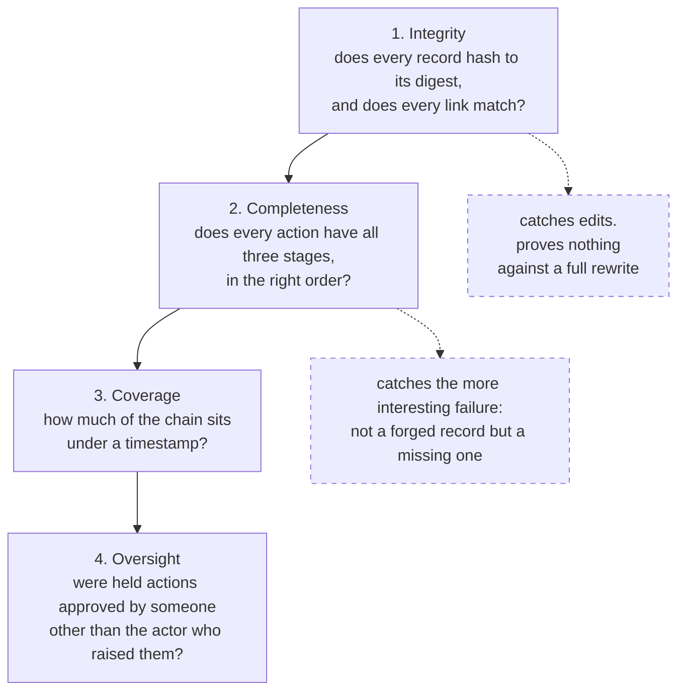

# Provenance — every record, and every way it fails

**Written for:** an engineer or an auditor who needs to know exactly what the
ledger proves, exactly what it does not, and what a failure looks like.

[`docs/GOVERNANCE.md`](../GOVERNANCE.md) is the design. [audit-trail.md](audit-trail.md)
is why this replaces a hand-written `.compliance-trace/`. **This page is the
mechanism**: the bytes, a real worked example from this repository's own
ledger, and a catalogue of every failure mode with what each one looks like
when it happens.

Every number and every record below was read out of `provenance/chain.jsonl` in
this checkout on 2026-09-24. Nothing here is illustrative.

---

## 1. The idea in one paragraph

An agent action is not one event, it is **five**. What was proposed, what the
gate decided, what actually happened, a hash linking those three to everything
before them, and a signature from outside this repository saying the link
existed by a certain time. The split is the whole point: a system that records
only what happened cannot answer whether what happened was what was *meant* to
happen, or whether anything checked.

```
01 INTENT      what the agent proposed        written BEFORE the action
02 DECISION    the gate's verdict on it       written BEFORE the action
03 EXECUTION   what actually happened         written AFTER the action
04 CHAIN       each record hashes the last    pf.provenance.chain
05 TIMESTAMP   the head, signed by a stranger pf.provenance.anchor
```

Stages 01–03 are records in [`record.py`](../../platform/src/pf/provenance/record.py).
Stage 04 is [`chain.py`](../../platform/src/pf/provenance/chain.py); stage 05 is
[`anchor.py`](../../platform/src/pf/provenance/anchor.py).

**The ordering is the guarantee, not the paperwork.** INTENT is written before
the gate is consulted, so a *denied* action still leaves evidence it was
attempted. A gate that only logs its refusals can prove it said no; it cannot
prove it was ever asked.

---

## 2. A worked example: the write that was refused

On 2026-09-22 something tried to write `provenance/ledger.jsonl` — a path
`gate.yaml` denies to every agent, on the principle that *you may not edit the
record of what you did*. Three records went into the chain, at sequence numbers
6929, 6930 and 6931. Here they are, exactly as stored, trimmed only of
whitespace that is not in the file:

**Stage 01 — INTENT, seq 6929.** Written before the gate was asked anything.

```json
{"action_id":"fcc4a4bcf4c9412082cccf1fea4b8920","actor":"sswaminathan",
 "group":"","payload":{"cwd":"/Users/…/data-platform","session":"t",
 "summary":"Write ledger.jsonl"},
 "prev":"e43ce70420e49ffa58a24117f47c7d7e92d3f331970d21472b3b886563bc9465",
 "project":"","seq":6929,"session":"","stage":"intent",
 "target":"provenance/ledger.jsonl","tool":"Write","ts":"2026-09-22T13:18:09Z",
 "hash":"55e1c2b7fe7ed6495791ae2193fa726cb3d5334388a1243c6dee30c13e60bbb7"}
```

**Stage 02 — DECISION, seq 6930.** The gate said no, and said which rule.

```json
{"action_id":"fcc4a4bcf4c9412082cccf1fea4b8920","actor":"sswaminathan",
 "group":"","payload":{"enforcing":false,
 "message":"generated artefact or secret — never edited by hand",
 "rule":"denylist:provenance/**","verdict":"deny"},
 "prev":"55e1c2b7fe7ed6495791ae2193fa726cb3d5334388a1243c6dee30c13e60bbb7",
 "project":"","seq":6930,"session":"","stage":"decision",
 "target":"provenance/ledger.jsonl","tool":"Write","ts":"2026-09-22T13:18:09Z",
 "hash":"0bca4165fb14c67c23143878bb572f94bf29a1a0c36cc49e4d6c384d97397123"}
```

**Stage 03 — EXECUTION, seq 6931.** The refusal was carried out.

```json
{"action_id":"fcc4a4bcf4c9412082cccf1fea4b8920","actor":"sswaminathan",
 "group":"","payload":{"status":"blocked",
 "detail":"denylist:provenance/**: generated artefact or secret — never edited by hand"},
 "prev":"0bca4165fb14c67c23143878bb572f94bf29a1a0c36cc49e4d6c384d97397123",
 "project":"","seq":6931,"session":"","stage":"execution",
 "target":"provenance/ledger.jsonl","tool":"Write","ts":"2026-09-22T13:18:09Z",
 "hash":"1938c73ed68c8235e92e6a95606411628d9a4d392f885160bc334abe1dd9855d"}
```

Read the `prev` and `hash` fields down the three records and the structure is
visible:

```
 seq 6928  …            hash e43ce704…
                             ▼ becomes
 seq 6929  INTENT     prev e43ce704…   hash 55e1c2b7…
                                            ▼ becomes
 seq 6930  DECISION   prev 55e1c2b7…   hash 0bca4165…
                                            ▼ becomes
 seq 6931  EXECUTION  prev 0bca4165…   hash 1938c73e…
                                            ▼ becomes
 seq 6932  …          prev 1938c73e…
```

`action_id` is what makes the three one story. Without it the ledger is three
unrelated rows; with it, an audit reads *this was proposed, this was decided,
this happened*.

Note `"enforcing": false` in the DECISION. The ledger records the mode it was
running in, so a reader three years from now does not have to guess whether an
unrecordable action would have been blocked that day.

### Read it yourself

```bash
uv run pf provenance log --action fcc4a4bc     # the three stages, rendered
uv run pf provenance log -n 20                 # the last twenty records
```

---

## 3. Recomputing a hash by hand

"Verifiable by anyone" means a third party recomputes our hashes with nothing
of ours but the record. Here is that, on the DECISION above:

```python
import hashlib, json
rec  = json.loads(line)                      # seq 6930, from chain.jsonl
body = {k: v for k, v in rec.items() if k != "hash"}
b    = json.dumps(body, sort_keys=True, separators=(",", ":"),
                  ensure_ascii=False).encode("utf-8")
assert hashlib.sha256(b).hexdigest() == rec["hash"]
```

Run against this repository's ledger that assertion holds: **435 canonical
bytes**, digest `0bca4165fb14c67c23143878bb572f94bf29a1a0c36cc49e4d6c384d97397123`.
The bytes begin:

```
{"action_id":"fcc4a4bcf4c9412082cccf1fea4b8920","actor":"sswaminathan","group":"",
"payload":{"enforcing":false,"message":"generated artefact or secret — never edited
by hand","rule":"denylist:provenance/**","verdict":"deny"},"prev":"55e1c2b7…
```

Six lines of stdlib. That is the entire trust requirement.

### Why serialisation is pinned rather than left to a default

The digest must be a function of the record's *content*, never of the writer.
[`record.py`](../../platform/src/pf/provenance/record.py) fixes four things:

| Rule | Because |
|---|---|
| keys sorted | field order in a dataclass must never change a hash |
| no whitespace | a pretty-printer cannot silently break the chain |
| `ensure_ascii=False`, explicit UTF-8 | a non-ASCII project name hashes the same from any writer |
| **floats refused outright** | `0.1` does not round-trip identically across languages, and a verifier written in Go must reach our digest |

This is RFC 8785 (JCS) in the subset we allow. A JCS *library* is deliberately
not imported: the verifier has to be re-implementable in an afternoon by
someone who does not trust us, and a dependency they must also trust defeats
that. Passing a float raises `NonCanonical` at write time — the one input the
ledger refuses rather than records.

---

## 4. Where records come from

| Writer | Covers | Stages |
|---|---|---|
| [`platform/hooks/pre_tool_use.py`](../../platform/hooks/pre_tool_use.py) | every Claude Code tool call | 01, 02 |
| [`platform/hooks/post_tool_use.py`](../../platform/hooks/post_tool_use.py) | the same call, afterwards | 03 |
| `pf.agents.base` | programmatic LLM calls (Dagster, loops) | 01–03 |
| `pf.provenance.action()` | anything else, as a context manager | 01–03 |

`action()` is the preferred entry point because it closes the two gaps a
hand-written sequence leaves: an EXECUTION that never runs because the body
raised, and an EXECUTION whose status says `ok` because nobody checked.

```python
with action(root, tool="dbt", target="model.x", summary="rebuild") as a:
    a["detail"] = run_model()
```

A caller who writes the three records by hand can reorder them. A caller using
`action()` cannot.

### What is in scope

`MUTATING = {Edit, Write, MultiEdit, NotebookEdit, Bash}` — reads are not
recorded, because a chain in which every file view is an action buries the
writes that matter. `PF_PROVENANCE_SCOPE=all` records everything.

`GATED` is the same set **minus Bash**. Bash is recorded but not path-gated:
its safety rules live in the permissions layer, and pretending a command string
is a path would produce confident, wrong verdicts. This is why 96% of this
repository's decisions read `ungated` — see §7.

### How the two hooks find each other

They are separate processes, so the `action_id` minted while writing INTENT has
to survive to the process that writes EXECUTION. Claude Code supplies
`tool_use_id` on both sides when it can, and that is used verbatim; otherwise
the key is a SHA-256 of `(session_id, tool_name, tool_input)`, stable across
the pair. The mapping lives in `provenance/pending.json`, **not** in the chain —
an unclaimed entry is a process that died between the hooks, and it should
expire quietly rather than accumulate as evidence of nothing.

---

## 5. What the audit checks

`pf provenance verify` asks four questions, in order of what they can prove.
A clean result on the first alone is the answer that flatters us most and means
least, so the report never returns integrity without the other three.



Every finding the audit can emit, and whether it stops a build:

| Code | Level | Means |
|---|---|---|
| `chain.intact` | PASS | every record hashes to its digest, every link matches |
| `chain.broken` | **FAIL** | a record was edited, resealed, removed or is unparseable |
| `action.ungated` | **FAIL** | something **executed with no DECISION** — it bypassed the gate |
| `decision.not_enforced` | **FAIL** | recorded `deny`/`hold` but ran anyway; the verdict was advisory |
| `stage.out_of_order` | **FAIL** | DECISION precedes INTENT, or EXECUTION precedes DECISION |
| `oversight.self_approved` | **FAIL** | approved by the same identity that raised it |
| `action.dangling` | WARN | intended and decided, never completed |
| `action.incomplete` | WARN | some other stage missing |
| `anchor.none` | WARN | never timestamped; the chain's age rests on our word |
| `anchor.lag` | WARN | *n* records written since the last anchor |
| `anchor.current` | PASS | the head is anchored |

**Exit code is 1 if any FAIL is present, 0 otherwise.** Warnings never fail the
command — which is a real decision with a real cost, examined in §7.

`decision.not_enforced` is the subtle one and the reason the audit exists. It
catches a gate that *reports* denials it does not actually impose: the failure
mode where the ledger looks strictest exactly where it is weakest, because
every blocked action is recorded and none of them were blocked.

---

## 6. Every way it fails

This is the section to read twice. Failures fall into three families: someone
tampered, something was missed, or the machinery itself broke.

### 6.1 Tampering — caught by stage 04

Each is a real test in
[`platform/tests/gate/test_provenance.py`](../../platform/tests/gate/test_provenance.py)
(23 tests), which CI runs *before* it verifies the ledger — a chain whose
tamper detection is broken would otherwise report a clean result for everything
after it.

| Attack | What the audit reports |
|---|---|
| **Edit a record in place** | `hash` break at that seq — "record does not hash to its stated digest" |
| **Edit it and re-seal it** so it hashes correctly | `link` break at seq **+1** — the successor's `prev` no longer matches |
| **Remove a record** | `sequence` break — "expected seq N, found N+1" |
| **Rewrite the whole file** consistently | **nothing.** This is what stage 05 is for |
| **Truncate the tail** | deliberately *not* flagged. A prefix is a valid chain — only an anchor over a later head exposes it |
| **Corrupt a line** | `parse` break, and verification stops there |

`verify()` deliberately does not stop at the first break. An auditor needs to
know whether one record was edited or the file was rewritten from some point
on, and that is the difference between one `hash` break and a run of them.

**The honest limit.** Every byte of the chain is ours, so a full rewrite
produces a perfectly consistent chain. The chain alone is tamper-evident to
someone holding an earlier head; the anchor is what makes it evident to someone
who has only ever seen the file once. This repository has **no anchors** (§8).

### 6.2 Gaps — caught by stage 02/03 completeness

| Symptom | What it means | Level |
|---|---|---|
| EXECUTION with no DECISION | work that bypassed the gate | **FAIL** |
| DECISION `deny`, EXECUTION `ok` | the gate is decorative | **FAIL** |
| DECISION before INTENT | not a race — a record written to fit a story already told | **FAIL** |
| INTENT + DECISION, no EXECUTION | a process that died mid-action | WARN |
| approver == actor | self-approval. Written, then flagged — a finding, not something to silently refuse | **FAIL** |

The post-tool hook is careful about the first row. If it finds no INTENT to
close, it writes **nothing** rather than a bare EXECUTION — manufacturing an
action that was never gated is exactly the finding the verifier exists to
raise.

### 6.3 Operational failures — the ones that actually happen

These are not attacks. They are the machinery failing, and they are the
majority of what you will see.

#### (a) A failing tool call leaves a dangling action — **verified here**

This repository's ledger holds **277 dangling actions** out of 7,195. They are
not random. A controlled experiment in this checkout:

```
head before                             seq 21313
run: echo "MARKER-A-ok"       → seq 21314  EXECUTION  status=ok      ✓ complete
run: echo "…" && exit 3       → seq 21315  INTENT
                                 seq 21316  DECISION  verdict=allow
                                 (no EXECUTION)                      ✗ dangling
```

**A tool call that exits non-zero never gets its EXECUTION record.** Claude
Code fires a separate `PostToolUseFailure` event when a tool fails, and
[`.claude/settings.json`](../../.claude/settings.json) registers only
`PostToolUse`. So the hook that closes the action never runs.

The evidence matches exactly: of the 277 dangling actions, **276 are `Bash`**
and 1 is a `Write`, and `provenance/pending.json` holds **exactly 277**
unclaimed correlation keys — one per action whose closing hook never fired.

This is worth being precise about, because it is easy to misread the ledger:

> A dangling action does **not** mean the action did not happen. It means the
> ledger cannot say how it ended. In this repository the most common cause is
> simply that the command returned non-zero.

*Fix:* register the same hook on `PostToolUseFailure`. Until then, treat
`action.dangling` as "outcome unknown", not "nothing happened".

#### (b) `pending.json` overflows and orphans an EXECUTION

The correlation stash is bounded at `PENDING_MAX = 512`; past that it keeps the
newest half. This repository sits at **277**, so nothing has been dropped yet.
When one is dropped, the later EXECUTION loses its link back to its INTENT and
shows as a gap — visibly wrong, rather than an unbounded file. Because every
failing Bash call leaks one entry (§a), the counter only goes up; fixing (a)
fixes this too.

#### (c) The ledger cannot be written — and by default the work continues

```
PF_PROVENANCE_ENFORCE=0   (default) record-keeping failure never blocks work
PF_PROVENANCE_ENFORCE=1             an unrecordable action is a denied action
```

**This repository runs fail-open** (`pf provenance status` → `enforcing no`).
The reasoning is stated rather than hidden: a governance system whose failure
mode is "the whole team stops" gets switched off, and a governance system that
is switched off records nothing. Regulated deployments should set `1` and
accept the trade.

The consequence is exact: **under the default, a disk error produces a silently
missing record, not a blocked action.** Nothing in the chain marks the gap,
because the thing that would have marked it is the thing that failed.

Two things ignore the flag on purpose:

- **Revocation.** A revoked actor is refused at INTENT, before the gate is even
  consulted. Revocation a fail-open setting could bypass is not revocation.
- **An unreadable `revoked.json`.** Treated as *engaged*. "I cannot tell
  whether you are revoked" must not resolve to "carry on".

#### (d) The platform is unimportable

Both hooks return 0 and record nothing. A broken checkout must not stop a
session. The pre-hook imports the gate and the provenance package
**separately**, so a platform new enough to gate but without the provenance
package still gates — degraded recording, never degraded enforcement.

#### (e) Two hooks race on append

Parallel tool calls mean two processes can reach `append()` at the same
instant. Without a lock both read the same head, both write `prev = H`, and the
chain forks — which reads to a verifier as *tampering* rather than as a race.
An `flock` over the whole read-head-then-write makes the sequence a total
order. The lock is a separate `.lock` file, not the chain itself: an fd opened
for append cannot be locked before it exists.

#### (f) The process dies between the append and the head update

`append()` writes the record, `flush`es, `fsync`s, and only then moves the
`head.json` sidecar. If it dies between the two, the sidecar is
**stale-but-behind** and the scan fallback recovers the true tip. The reverse
order would advertise a head for a record that was never written. A missing
sidecar means "go and look", not "start over" — otherwise deleting one file
would reset the chain to genesis and orphan every record.

#### (g) The anchor cannot be obtained

A TSA that is unreachable, times out, or returns a non-granted status is
recorded as a `failed` anchor and the chain is unharmed: the next run anchors a
later head, which covers everything this one would have. Anchoring is
deliberately **not** in the hook — a PreToolUse hook that makes a network call
adds its latency and its failure modes to every single tool call.

`stamp_ots` returns `pending`, never `ok`: the `.ots` receipt is a promise that
the hash is queued for Bitcoin aggregation, and it becomes a real proof only
after `pf provenance upgrade` fetches the confirmed attestation hours later.
Reporting it as `ok` at submission would overstate the evidence.

---

## 7. What this repository's ledger actually says

Read from `provenance/chain.jsonl` on 2026-09-24. `pf provenance verify`
**passes** — no FAIL findings — in 1.7 seconds over 16.4 MB.

```
records          21,308        2026-09-20T12:47Z → 2026-09-24T17:12Z
actions           7,195
head sequence    21,304        chain.jsonl = 16.4 MB
anchored through     -1        never
enforcing            no        fail-open
kill switch       clear
```

| Stage | Count | | Verdict | Count |
|---|---|---|---|---|
| intent | 7,195 | | allow | 7,194 |
| decision | 7,195 | | **deny** | **1** |
| execution | 6,918 | | | |

| Rule that decided | Count | | Execution status | Count |
|---|---|---|---|---|
| `ungated` | 6,909 | | ok | 6,856 |
| `agent_routing` | 122 | | error | 61 |
| `default` | 114 | | blocked | 1 |
| `allowlist:**/*.md` | 33 | | | |
| `denylist_except` | 16 | | | |
| `denylist:provenance/**` | 1 | | | |

### Three things these numbers say plainly

**1. 96% of decisions are `ungated`.** 6,909 of 7,195 actions are `Bash`, and
Bash is recorded but not path-gated by design (§4). This is not a defect, but
it does mean the sentence *"every agent action passes a policy gate"* is false
as stated. The true sentence is: *every agent action is recorded, and every
file-writing action passes a path gate.* A shell command that writes a file is
recorded as `ungated` — the permissions layer is what constrains it, and the
permissions layer does not write to this chain.

**2. The one `deny` in the ledger is an agent trying to edit the ledger.** That
is the system working, and it is also the entire enforcement history: one
refusal in 7,195 actions. A ledger of almost-all-allows is the expected shape
for a gate that is mostly correct, but it means the `deny` path has almost no
production exercise behind it. The 23 unit tests are doing that work instead.

**3. Every record names the same actor, and no record names a session.**
All 21,308 records say `actor: "sswaminathan"` — `_actor()` falls back to
`$USER`, and `PF_ACTOR` / `CLAUDE_AGENT` are unset, so **the human and the
agent are indistinguishable in this ledger**. That limit is stated in the
source rather than papered over: the ledger records a *claim*, and the claim is
only as good as whatever set the variable. Binding an action to an identity
needs a signature, which is the natural extension once actors have keys.

The `session` column is emptier still — `""` on all 21,308 records, because
`_session()` reads `CLAUDE_SESSION_ID`, which the harness does not set. The
information is not missing: `pre_tool_use.py` puts the real session id into
`payload["session"]` (verified: `"session": "3f4a4bbb-3993-4c70-b8d4-a1aa6d662710"`
at seq 21315). It simply never reaches the top-level field, so **the ledger
cannot be grouped by session** without parsing payloads. Given that multiple
sessions run concurrently in this one checkout, that is the field you would
most want. Small fix, real gain.

---

## 8. What CI verifies — and the two things it does not

The `AI governance` workflow runs on every pull request and daily at 07:23. Its
`provenance` job has three steps.

| Step | Runs? | Blocks? |
|---|---|---|
| Unit tests for the chain (23 tests) | **yes, always** | **yes** |
| `pf provenance verify --anchors` | **no, on a PR** | never reached |
| Independent stdlib verifier | **no, on a PR** | never reached |
| Timestamp anchor coverage | skipped on PRs | never, by design |

Both verification steps are wrapped in:

```bash
if [ -f provenance/chain.jsonl ]; then …
```

and `provenance/*` is gitignored, so **on a fresh CI checkout that condition is
always false.** The steps print "No ledger in this checkout" and pass.

This is not concealed — the workflow's own comments reason about it, correctly:
the ledger is runtime evidence, and a fresh checkout has no runtime evidence in
it, which is not the same as evidence that failed. Archived evidence comes from
`pf provenance export`. But the consequence should be stated where people read
it, because `CLAUDE.md:31` says "`pf provenance verify` blocks CI":

> **On a pull request, CI proves the verifier works. It does not verify any
> ledger.** Those are different claims. Verifying a real chain happens where
> the chain lives — on a developer's machine, or wherever `pf provenance
> export` sends the bundle.

The second gap is stage 05. `provenance/anchors/` **does not exist** in this
repository; zero tokens are committed. The `anchor` job notices and emits a
`::warning` saying so, never a failure — and its reasoning is sound (a stale
anchor is a fact about the repository, not about the change under review;
failing a PR for it would block an author over something they cannot fix).

The effect stands regardless of the reasoning:

> **Stages 01–04 are in force. Stage 05 is designed, tested and not running.**
> The chain proves records were not altered relative to each other. Only an
> anchor proves the chain existed at a point in time — and without one, a full
> rewrite is undetectable to anyone who has not seen an earlier head.

*To close it:* `pf provenance anchor --kind both`, scheduled where the ledger
lives, committing the `.tsr` under `provenance/anchors/`. That directory is
already carved out of [`.gitignore`](../../.gitignore) precisely so an auditor
gets the tokens alongside the chain. See "Scheduling the anchor" in
[`docs/GOVERNANCE.md`](../GOVERNANCE.md).

---

## 9. The evidence bundle

```bash
uv run pf provenance export /path/to/bundle
```

Writes the chain, the anchors and a **stdlib-only verifier** that does not
import this platform. An auditor receives the evidence and the means to check
it in one delivery, and checking it never requires trusting the system that
produced it. The bundled script is
[`platform/entrypoints/verify_provenance.py`](../../platform/entrypoints/verify_provenance.py)
— about 150 lines, with the full record spec in its docstring so it can be
reimplemented in any language.

CI runs that script *alongside* `pf provenance verify` (when there is a ledger
to run it on) for a specific reason: if the two ever disagree, the bundled
verifier is the one that is wrong in the way that matters, because it is the
one shipped to people who cannot check our work.

> **Doc drift, minor:** the package docstring in
> [`pf/provenance/__init__.py`](../../platform/src/pf/provenance/__init__.py)
> points at `provenance/verify_chain.py`. No such file exists; the script is at
> the path above.

---

## 10. Commands

| Command | Answers |
|---|---|
| `pf provenance status` | head, enforcement mode, kill switch, anchor lag — one screen |
| `pf provenance log -n 20` | the last twenty records |
| `pf provenance log --action <id>` | one action's three stages |
| `pf provenance verify` | the full audit; **non-zero on any FAIL** |
| `pf provenance verify --anchors` | the same, plus `openssl ts -verify` / `ots verify` |
| `pf provenance anchor --kind both` | timestamp the current head, RFC 3161 and OpenTimestamps |
| `pf provenance upgrade` | turn pending OTS receipts into confirmed attestations |
| `pf provenance approve <id>` | record human approval for a held action |
| `pf provenance revoke [actor] -r "…"` | kill switch — refused at INTENT, before the gate |
| `pf provenance reinstate [actor]` | release it |
| `pf provenance export <dir>` | the auditor's bundle |
| `pf provenance sync` | replay the chain into DuckDB for querying |

**The database is a mirror, not the record.** Nothing writes to DuckDB on the
hot path — it is a single-writer store, and two concurrent hooks contending for
its lock would add exactly the latency and failure surface the design avoids.
A mirror that disagrees with `chain.jsonl` loses.

---

## 11. Summary — what to believe

| Claim | Status |
|---|---|
| Every mutating tool call is recorded before it runs | **holds** — 21,308 records, INTENT always precedes the gate |
| A denied action leaves evidence it was attempted | **holds** — verified at seq 6929–6931 |
| Records cannot be edited without detection | **holds** — 23 attack tests, all four break kinds |
| Every record is reproducibly hashable by a stranger | **holds** — recomputed by hand in §3 |
| Every action passes a policy gate | **false as stated** — 96% are `ungated` Bash; file writes are gated |
| Every action's outcome is recorded | **false** — 277 dangling; failing commands lose their EXECUTION |
| Records are attributable to an actor | **weak** — attribution, not authentication; all 21,308 say `$USER` |
| CI verifies the ledger on every PR | **false** — CI verifies the *verifier*; the ledger is not in the checkout |
| The chain's age is provable | **not yet** — stage 05 is built, tested and has never run here |

The first four are the ones that do the work, and they hold. The rest are
written down because an audit trail whose limits are documented is worth more
than one whose limits are discovered.

---

*Reference: [`docs/GOVERNANCE.md`](../GOVERNANCE.md) · sibling pages:
[audit-trail.md](audit-trail.md) · [gates.md](gates.md) ·
[converged.md](converged.md) · [tests.md](tests.md) · index:
[README.md](README.md)*
