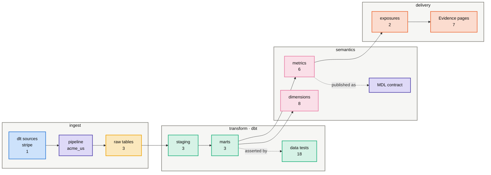
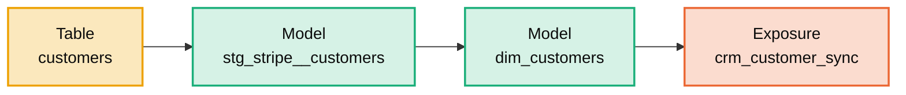
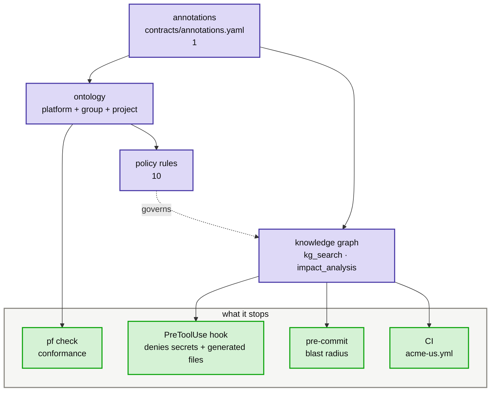

<!-- GENERATED by `pf arch <group> <project>`, and by every `pf bootstrap`. Never hand-edit: the next bootstrap overwrites it, and `pf arch --check` fails on the drift in the meantime. -->
# acme-us — architecture

**acme** group · entity · warehouse `snowflake` · module `acme_us`

Generated from this project alone. Sister projects are never read; cross-entity questions belong in the roll-up.

## The spine

## A real path through it

## What enforces what

## Every feature, present or not

| feature | | where | what it is |
|---|---|---|---|
| **ingest** | | | |
| dlt sources | ✓ | `src/acme_us/sources/stripe.py` | the only place raw data enters; each declares its ontology concept |
| dlt config | ✓ | `.dlt/config.toml` | pipeline settings and destination; secrets live beside it, ungitted |
| ontology annotations | ✓ | `contracts/annotations.yaml` | concept and column roles — drives staging, PII policy and monitors |
| raw tables | ✓ 3 | `data/acme_us.duckdb` | what the pipeline actually landed |
| **transform** | | | |
| dbt project | ✓ | `transform/dbt_project.yml` | the transform runtime; macro-paths reach the platform's macros |
| dbt targets | ✓ | `transform/profiles.yml` | dev, base and prod; base is what Recce diffs against |
| staging models | ✓ 3 | `transform/models/staging/stripe/stg_stripe__charges.sql` | one per raw table, generated from the annotations |
| marts | ✓ 3 | `transform/models/marts/dim_customers.sql` | business entities at a declared grain — what metrics are built on |
| data tests | ✓ 18 | `transform/models/marts/_core__models.yml` | the assumptions the models are allowed to make |
| project macros | — | `transform/macros/**/*.sql` | project-local SQL; dialect macros come from the platform toolkits — `/using-dbt` |
| snapshots | — | `transform/snapshots/**/*.sql` | slowly-changing dimensions captured over time — `/using-dbt` |
| dbt packages | ✓ | `transform/packages.yml` | the group's shared dbt package, plus any upstream ones |
| **semantics** | | | |
| metrics | ✓ 6 | `transform/models/semantic/metrics_revenue.yml` | the governed answer to a business question; never ad-hoc SQL |
| dimensions | ✓ 8 | `transform/models/semantic/metrics_revenue.yml` | how a metric may be sliced; conformed ones come from the group |
| knowledge graph | ✓ | `kg/graph.duckdb` | kg_search, kg_neighbors and impact analysis read this, not the files |
| context card | ✓ | `kg/context_card.md` | the always-on index; ~400 tokens, budgeted by `pf tokens` |
| architecture map | ✓ | `kg/architecture.md` | this document — the on-demand map, regenerated never hand-edited |
| MDL manifest | ✓ | `mdl/mdl.json` | the semantic contract an external consumer reads (WrenAI, BI) |
| catalog export | ✓ | `catalog/openmetadata.json` | OpenMetadata ingestion, for a company that runs one |
| **governance** | | | |
| project policy | ✓ 10 | `governance/policy.yaml` | the third ontology layer; may only tighten platform and group |
| otop manifest | ✓ 9 | `governance/otop.json` | policy and evidence as an OpenTopology graph, schema-validated |
| project rules | ✓ | `CLAUDE.md` | the rules the graph cannot encode; loaded every session |
| agent permissions | ✓ | `.claude/settings.json` | the deny list and the PreToolUse hook — sisters unreadable by policy |
| decision records | ✓ 2 | `decisions/ADR-0001-platform-macros-on-macro-paths.md` | why this project is shaped the way it is, where code cannot say so |
| **delivery** | | | |
| exposures | ✓ 2 | `transform/models/marts/_core__models.yml` | who reads the output — impact analysis stops at the mart without them |
| Evidence BI | ✓ | `reporting/pages/index.md` | dashboards as a projection of the metrics, never restating logic |
| capability docs | ✓ 5 | `docs/github.md` | one page per capability, explaining what it wired in |
| **operate** | | | |
| Dagster definitions | ✓ | `src/acme_us/definitions.py` | assets come from the runtime factory; the project supplies logic |
| Dagster registration | ✓ | `platform/workspace.yaml` | an unregistered project silently never runs |
| CI workflow | ✓ | `.github/workflows/acme-us.yml` | one workflow per project, composed from its capabilities' jobs |
| eval cases | **gap** | `evals/cases/**/*.yaml` | does an agent still answer this project's questions correctly — `pf evals-gen` |
| agent memory | ✓ | `.memory/notes` | session notes that survive a compaction |
| duckdb memories | ✓ | `.duckdb-skills` | query patterns the duckdb-ops toolkit reuses |
| tool overrides | — | `tools.yaml` | opt out of a group tool or retune one; merged over the group's — `pf tool enable` |
| project deps | ✓ | `pyproject.toml` | the project's own Python dependencies, on top of the platform's |

**Capabilities:** `evidence`, `github`, `openmetadata`, `recce`, `snowflake`, `wren`

**Tools enabled:** `openmetadata`, `recce`, `wren`

**PII columns:** 6 — masked by policy, never selected into a mart unaggregated

## Gaps

- **eval cases** — does an agent still answer this project's questions correctly. Fix: `pf evals-gen`

---

Query before reading: `kg_search`, `kg_neighbors`, `kg_path`, `impact_analysis`. Regenerate this file with `pf arch acme acme-us`.
