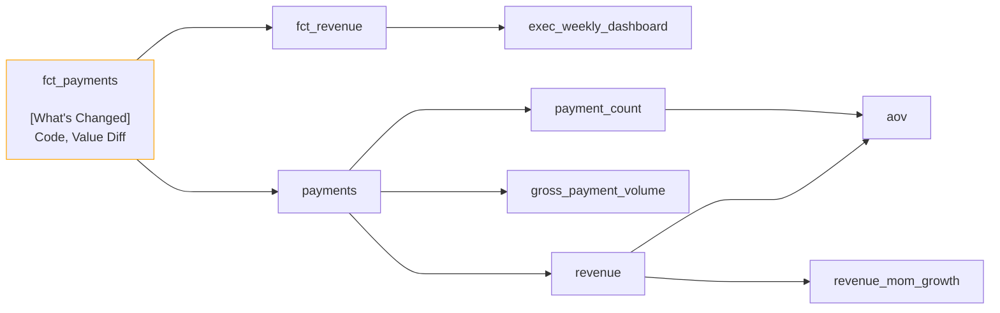

# Recce Summary
## Manifest Information
|        |Manifest            |Catalog             |
|--------|--------------------|--------------------|
|Base    |2026-08-13 14:34:08 |2026-08-13 14:34:08 |
|Current |2026-08-13 14:39:08 |2026-08-13 14:34:08 |

## Lineage Graph

## Checks Summary
|Checks Run|Data Mismatch Detected|
|----------|----------------------|
|    17    |           3          |

### Checks of Data Mismatch Detected
|Name                                    |Type       |Mismatched Nodes|
|----------------------------------------|-----------|----------------|
|Value diff — fct_payments               |Value Diff |fct_payments    |
|Category drift — fct_payments.plan_tier |Query Diff |N/A             |
|Category drift — fct_revenue.plan_tier  |Query Diff |N/A             |
