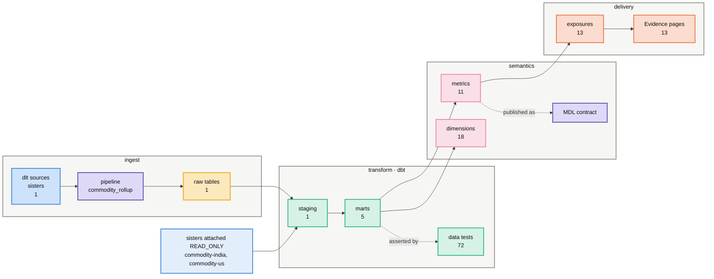
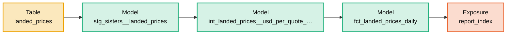
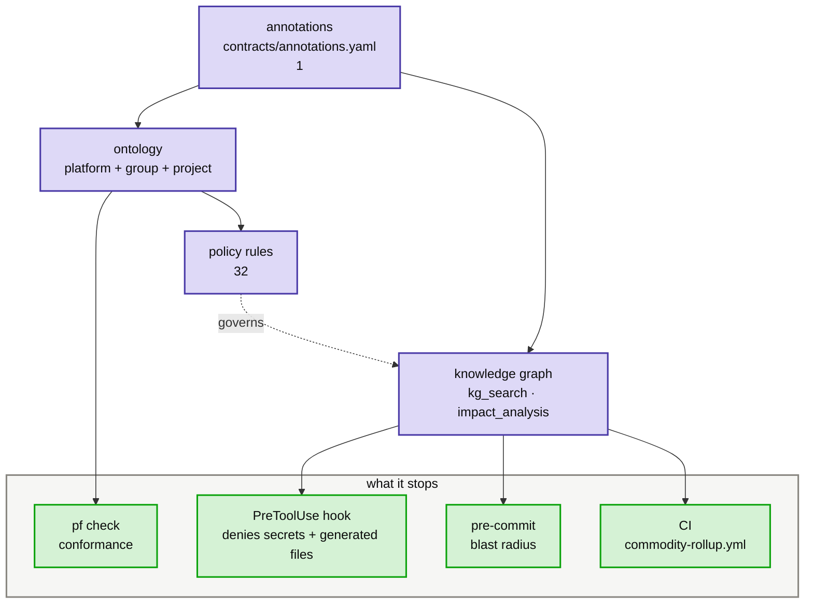

<!-- GENERATED by `pf arch <group> <project>`, and by every `pf bootstrap`. Never hand-edit: the next bootstrap overwrites it, and `pf arch --check` fails on the drift in the meantime. -->
# commodity-rollup — architecture

**commodity** group · roll-up · warehouse `duckdb` · module `commodity_rollup` · sisters attached: commodity-india, commodity-us

Generated from this project alone. Sister projects are never read; cross-entity questions belong in the roll-up.

## The spine

## A real path through it

## What enforces what

## Every feature, present or not

| feature | | where | what it is |
|---|---|---|---|
| **ingest** | | | |
| dlt sources | ✓ | `src/commodity_rollup/sources/sisters.py` | the only place raw data enters; each declares its ontology concept |
| dlt config | ✓ | `.dlt/config.toml` | pipeline settings and destination; secrets live beside it, ungitted |
| ontology annotations | ✓ | `contracts/annotations.yaml` | concept and column roles — drives staging, PII policy and monitors |
| raw tables | ✓ | `data/*.duckdb` | what the pipeline actually landed |
| **transform** | | | |
| dbt project | ✓ | `transform/dbt_project.yml` | the transform runtime; macro-paths reach the platform's macros |
| dbt targets | ✓ | `transform/profiles.yml` | dev, base and prod; base is what Recce diffs against |
| staging models | ✓ | `transform/models/staging/sisters/stg_sisters__landed_prices.sql` | one per raw table, generated from the annotations |
| marts | ✓ 5 | `transform/models/marts/core/dim_commodities.sql` | business entities at a declared grain — what metrics are built on |
| data tests | ✓ 72 | `transform/models/_reporting__exposures.yml` | the assumptions the models are allowed to make |
| project macros | — | `transform/macros/**/*.sql` | project-local SQL; dialect macros come from the platform toolkits — `/using-dbt` |
| snapshots | — | `transform/snapshots/**/*.sql` | slowly-changing dimensions captured over time — `/using-dbt` |
| dbt packages | ✓ | `transform/packages.yml` | the group's shared dbt package, plus any upstream ones |
| **semantics** | | | |
| metrics | ✓ 11 | `transform/models/semantic/metrics_market_comparison.yml` | the governed answer to a business question; never ad-hoc SQL |
| dimensions | ✓ 18 | `transform/models/semantic/metrics_market_comparison.yml` | how a metric may be sliced; conformed ones come from the group |
| knowledge graph | ✓ | `kg/graph.json` | kg_search, kg_neighbors and impact analysis read this, not the files |
| context card | ⟳ | `kg/context_card.md` | the always-on index; ~400 tokens, budgeted by `pf tokens` — regenerated by `pf kg card`, not tracked |
| architecture map | ✓ | `kg/architecture.md` | this document — the on-demand map, regenerated never hand-edited |
| project atlas | ✓ | `atlas.yaml` | a picture of this project's own graph, refreshed around its dbt runs |
| MDL manifest | ✓ | `mdl/mdl.json` | the semantic contract an external consumer reads (WrenAI, BI) |
| catalog export | ✓ | `catalog/openmetadata.json` | OpenMetadata ingestion, for a company that runs one |
| Wren workspace | ✓ 3 | `mdl/wren` | the semantic layer as an LLM may read it: restricted columns withheld, rules and remembered questions beside it |
| **governance** | | | |
| project policy | ✓ 32 | `governance/policy.yaml` | the third ontology layer; may only tighten platform and group |
| otop manifest | ✓ 15 | `governance/otop.json` | policy and evidence as an OpenTopology graph, schema-validated |
| project rules | ✓ | `CLAUDE.md` | the rules the graph cannot encode; loaded every session |
| agent permissions | ✓ | `.claude/settings.json` | the deny list and the PreToolUse hook — sisters unreadable by policy |
| harness map | ✓ | `HARNESS.md` | what wraps an agent here — settings, gate verdicts, hooks, CI, loops — read from the files that enforce it |
| MCP servers | ✓ | `.mcp.json` | the servers a capability wires into the agent's session; merged, never overwritten |
| decision records | ✓ 2 | `decisions/ADR-0001-the-sisters-are-the-raw-stage.md` | why this project is shaped the way it is, where code cannot say so |
| requirements | — | `requirements/**/*.md` | the business requirements it was built from: page snapshot, validated spec, trace — `/build-from-requirement` |
| **delivery** | | | |
| exposures | ✓ 13 | `transform/models/_reporting__exposures.yml` | who reads the output — impact analysis stops at the mart without them |
| Evidence BI | ✓ | `reporting/pages/index.md` | dashboards as a projection of the metrics, never restating logic |
| capability docs | ✓ 9 | `docs/air.md` | one page per capability, explaining what it wired in |
| published pages | — | `*.html` | standalone HTML about this project, kept beside what it describes — `written by hand` |
| **operate** | | | |
| Dagster definitions | ✓ | `src/commodity_rollup/definitions.py` | assets come from the runtime factory; the project supplies logic |
| Dagster registration | ⟳ | `platform/workspace.yaml` | the code location `pf bootstrap` writes into platform/workspace.yaml, machine-local and ungitted — regenerated by `pf bootstrap`, not tracked |
| CI workflow | ✓ | `.github/workflows/commodity-rollup.yml` | one workflow per project, composed from its capabilities' jobs |
| eval cases | **gap** | `evals/cases/**/*.yaml` | does an agent still answer this project's questions correctly — `pf evals-gen` |
| agent memory | ✓ | `.memory/notes` | session notes that survive a compaction |
| duckdb memories | ⟳ | `.duckdb-skills/**` | query patterns the duckdb-ops toolkit reuses — regenerated by `pf bootstrap`, not tracked |
| tool overrides | ✓ | `tools.yaml` | opt out of a group tool or retune one; merged over the group's |
| project deps | ✓ | `pyproject.toml` | the project's own Python dependencies, on top of the platform's |
| air | ✓ | `air.yaml` | AI control baseline: declare it in air.yaml, gate the merge on it. |
| okf | ✓ | `okf/index.md` | Open Knowledge Format: the semantic layer as portable, validated context for agents. |

**Capabilities:** `air`, `ducklake`, `evidence`, `github`, `governance`, `loops`, `okf`, `openmetadata`, `recce`, `wren`

**Tools enabled:** `okf`, `openmetadata`, `recce`, `wren`

## Gaps

- **eval cases** — does an agent still answer this project's questions correctly. Fix: `pf evals-gen`

---

Query before reading: `kg_search`, `kg_neighbors`, `kg_path`, `impact_analysis`. Regenerate this file with `pf arch commodity commodity-rollup`.
